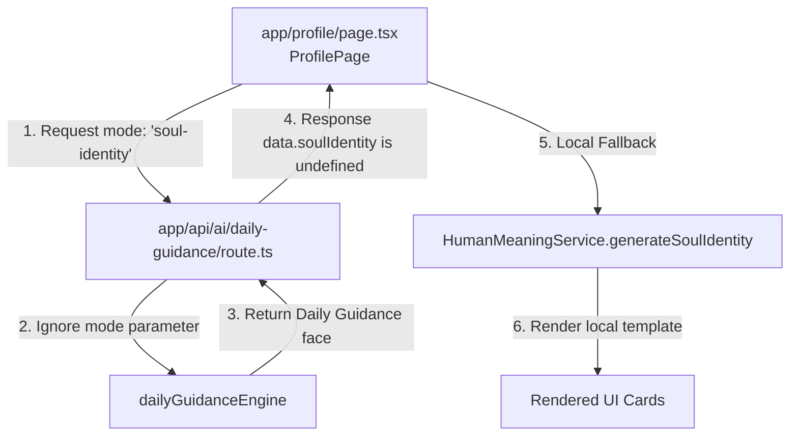
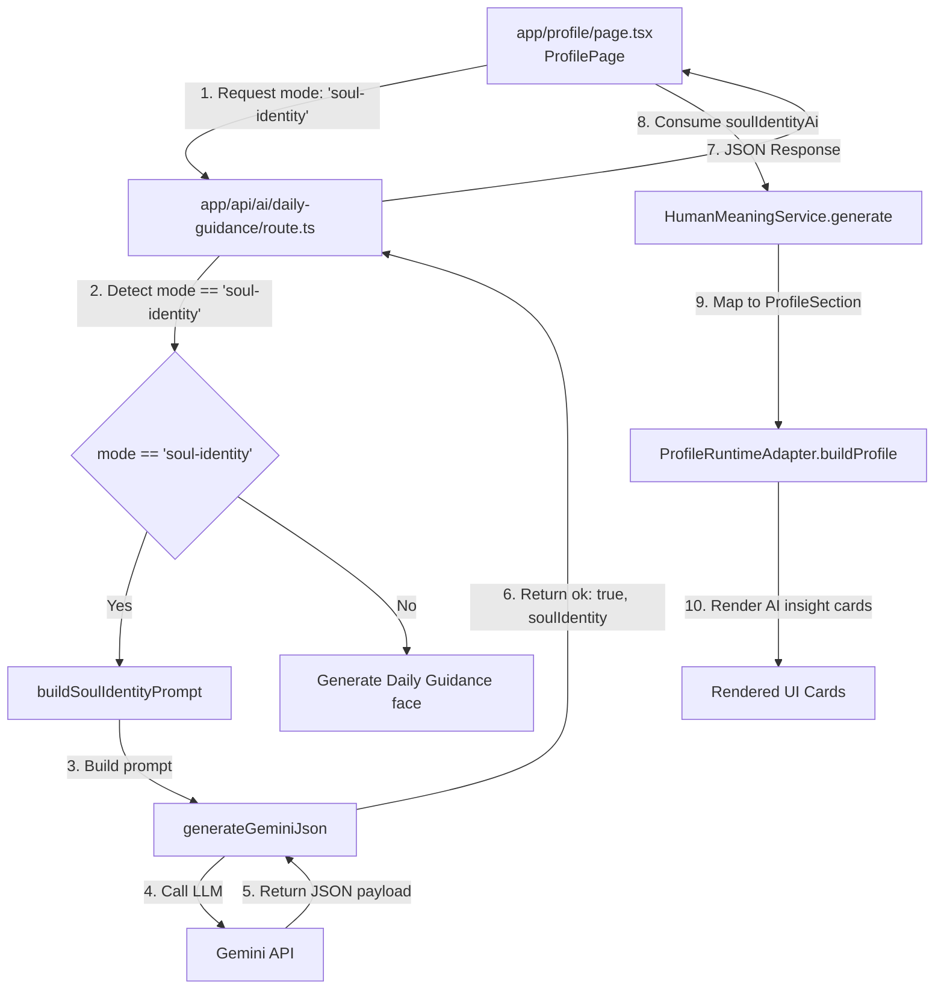

# BUILD 71 SOUL IDENTITY ROUTING FIX

This document verifies the implementation of the Soul Identity AI routing fix in Build 71.

---

## 1. Previous vs. New Runtime Graph

### Previous (Broken) Runtime Graph


### New (Correct) Runtime Graph


---

## 2. Traces & Fallback Verification

### 2.1. Execution Trace (Success Path)
1. **Request**: `ProfilePage` triggers a `POST` request to `/api/ai/daily-guidance` sending the user's `profile`, `blueprint`, and `mode: "soul-identity"`.
2. **Detection**: `app/api/ai/daily-guidance/route.ts` parses the JSON body and matches the condition `body?.mode === "soul-identity"`.
3. **Prompt Construction**: `buildSoulIdentityPrompt` is executed, synthesizing the 8-system blueprint details into a single cohesive system-level instructions prompt.
4. **AI Generation**: `generateGeminiJson` is called with the prompt. It makes a request to the configured Gemini model (e.g. `gemini-2.0-flash`), parses the response markdown JSON tags, and returns the strongly typed `soulIdentity` object.
5. **Response**: The API returns `{ ok: true, soulIdentity }`.
6. **Rendering**: The frontend saves the generated object into the profile snapshot (`localStorage`) and passes it to `HumanMeaningService.generate(canonical, soulIdentityAi)`. The Profile UI renders the AI-synthesized narrative for the Archetype, Mission, Gifts, Lessons, and Shadow.

### 2.2. Fallback Trace (Offline/Error Path)
1. **Request Failure**: If the device is offline, or if the Gemini API returns a rate-limit error (quota exceeded) or invalid JSON, the fetch block in `app/profile/page.tsx` throws an exception.
2. **Graceful Catch**: The frontend catches the exception safely (`console.warn("Failed to generate stable Soul Identity:", err)`).
3. **Local Synthesis**: `soulIdentityAi` remains `undefined`, and the code executes:
   ```typescript
   const meaning = HumanMeaningService.generate(canonical, undefined);
   ```
4. **Dynamic Paragraphs**: `HumanMeaningService.generateSoulIdentity(canonical.soulIdentity)` dynamically builds Indonesian sentences using the user's specific blueprint signals (e.g., life path, Sun sign, HD profile) ensuring the user is never presented with a blank profile screen.

---

## 3. Final Verification Status

**STATUS:** **PASS**
