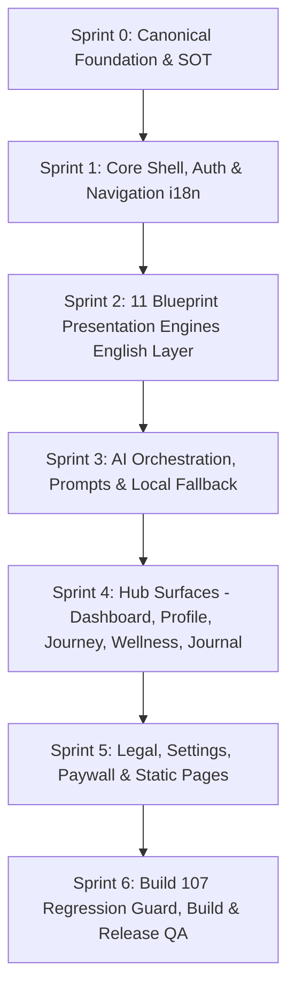

# BUILD 108 ENL — MASTER SOURCE OF TRUTH (SOT)
**Bhumi Amartya — Dedicated English-Language Edition & Architecture**

```text
STATUS                          = NOT_STARTED (FOUNDATION AUDIT & SPECIFICATION COMPLETE)
CURRENT_BASELINE                = BUILD 107 (versionCode 107, versionName 5.0.7)
BASELINE_COMMIT                 = d2ecb5ed73b7bb5e95415be314305f3512533752
INITIATIVE                      = BUILD 108 ENL
PURPOSE                         = Dedicated English-Language Edition / Global Release
BUILD_108_ENL_IMPLEMENTATION_STATUS = NOT_STARTED
NEXT_SAFE_ACTION                = FOUNDER_REVIEW_OF_BUILD_108_ENL_SOT
RELEASE_GATE                    = FOUNDER_SIGN_OFF_REQUIRED
```

---

## 1. Executive Summary & Production Baseline

### 1.1 Production Baseline: Build 107
The authoritative starting point and production baseline for all Build 108 work is **Build 107**:
- `versionCode` = `107`
- `versionName` = `"5.0.7"`
- Baseline Commit: `d2ecb5e` (`recovery/build106-product-continuity`)
- Release Status: **PRODUCTION**

Build 107 resolved three critical regressions discovered in Build 106:
1. **Human Design Identity Core convergence:** Existing/legacy users no longer hang on perpetual calculation states; recognized types resolve deterministically (`components/dashboard/CoreIdentity.tsx`).
2. **Withdrawal of internal Admin Console from production UI:** `components/navigation/AppNav.tsx` dropped all admin/diagnostics menu items and role checks. All `app/admin/*` routes are hard-gated by `isAdminUiExposed()` which evaluates `NEXT_PUBLIC_ENABLE_ADMIN_UI === "true"` (pinned `false` in production exports).
3. **Orphan route elimination:** Stale dev routes (`/status`, `/test`, `/roadmap`, `/changelog`, `/onboarding`) were deleted and guarded by static route assertions.
4. **Administrative & Lifetime authorization continuity:** Preserved all 4 admin accounts, Lifetime entitlements, and Firestore rules.

### 1.2 The Build 108 ENL Mission
`BUILD 108 ENL` is the dedicated **English-Language Edition** of Bhumi Amartya.
The core product objectives:
1. **End-to-End English User Experience:** Every user-facing screen, prompt, narrative, card, button, error message, and legal page must speak native, elegant, dignified English.
2. **Complete Inheritance:** Inherit 100% of Build 107 fixes, calculations, engines, security rules, and architectural continuity. Nothing from Build 107 may regress or disappear.
3. **Verified Lineage:** Build 108 must be constructed strictly as a descendant of the verified Build 107 source.

---

## 2. Canonical Authority Hierarchy

For all Build 108 ENL activities, the authority conflict order is:
1. **Explicit Founder Instruction** for the current task.
2. **Authorized Repository & Runtime Evidence** from the recovery worktree.
3. **`BUILD_108_ENL_MASTER_SOT.md`** (this document) — Primary product & architectural authority.
4. **`BUILD_108_ENL_SCOPE_MATRIX.md`** — Surface-by-surface status & classification ledger.
5. **`BUILD_108_ENL_HANDOFF.md`** — Operational handoff & task progression rules.
6. **`BUILD_108_ENL_RELEASE_PLAN.md`** — Release gates, verification suites, and deployment checklists.
7. **`BUILD_107_HOTFIX_RELEASE.md`** & **`BUILD_106_MASTER_SOT.md`** — Historical baseline lineage.
8. **Provenance-verified V5 documents** (`V5_*.md`).
9. Legacy documents (`SOT.md`, `PRD.md`, `TODO.md`, `BUILD_100_*.md`) remain historical and non-authoritative.

---

## 3. Build 107 Inheritance Guard & Invariants

Build 108 must explicitly guard and verify every element of Build 107:

### BUILD_107_INHERITANCE_CHECKLIST
- [ ] **Human Design Convergence:** Existing users with stored HD records must immediately resolve to their type in `CoreIdentity.tsx`. Perpetual "Menghitung..." / "Perlu kalkulasi ulang" must never return.
- [ ] **Admin UI Protection:** `isAdminUiExposed()` gate must remain active on `app/admin/page.tsx`, `app/admin/activity/page.tsx`, and `app/admin/diagnostics/page.tsx`. `scripts/run-prod-build.mjs` must pin `NEXT_PUBLIC_ENABLE_ADMIN_UI: 'false'`.
- [ ] **Clean AppNav Menu:** `components/navigation/AppNav.tsx` must never reintroduce Admin, Auth Diagnostics, or privileged role gating in production navigation.
- [ ] **Orphan Routes Stay Gone:** Routes `/status`, `/test`, `/roadmap`, `/changelog`, `/onboarding` and `AuditReadiness.tsx` must remain deleted.
- [ ] **Production Surface Guard:** `tests/unit/build107-production-surface-guard.test.ts` (131 assertions) must stay green.
- [ ] **Admin & Lifetime Entitlements:** Admin roles (`founder`, `admin`, `dev_admin`) and non-expiring Lifetime entitlements for the four canonical admin accounts must remain intact.
- [ ] **Firestore Rules Security:** Owner-isolation, authenticated reads/writes, and zero unauthorized public mutations must remain intact.
- [ ] **Deterministic Export & Build:** Web export (`output: 'export'`) -> Capacitor sync -> Android signed bundle pipeline must remain intact.

---

## 4. Architecture Recommendation & Critical Decisions

### 4.1 Evaluation of Architecture Approaches

We audited four architectural approaches for Build 108 ENL:

| Option | Architecture | Description | Pros | Cons | Recommendation |
|---|---|---|---|---|---|
| **A** | Same App, Forced English | Lock locale to `"en"` in existing `com.bhumiamartya.app` binary; drop language switching. | Minimal code divergence; fast build. | **Disastrous for existing Indonesian users:** If released as update to Build 107 on Google Play, all Indonesian users are abruptly forced to English with no way back. | **REJECTED** |
| **B** | Completely Separate Flavor | Create a new Gradle flavor / package ID `com.bhumiamartya.en` with separate codebase or branch. | Absolute physical separation; zero risk to Indonesian users. | High maintenance overhead; diverged codebases; dual Firebase configs, Google OAuth client IDs, and keystores. | **REJECTED (for codebase branching)** |
| **C** | **Unified Codebase with First-Class English Edition & Build-Target Flag (RECOMMENDED)** | Single unified codebase where English is 100% implemented across all surfaces, engines, and prompts. An environment/build flag (`NEXT_PUBLIC_APP_EDITION=ENL`) governs whether the artifact is a dedicated English release (locked to English, hidden selectors) or a multilingual global release. | Zero codebase divergence; single source of truth; full regression protection; supports both dedicated ENL store listing or unified multi-language listing. | Requires thorough, disciplined dictionary & presentation layer completion. | **RECOMMENDED (OPTION C)** |
| **D** | Dynamic Server-Driven Remote Config | Download localized copy dynamically via Firestore or Cloud Storage at runtime. | Instant copy tweaks without app updates. | High latency, offline vulnerability, complex caching, and violation of Bhumi local-first philosophy. | **REJECTED** |

### 4.2 The 10 Critical Architectural Decisions

#### Decision 1: Language Selectors Visibility in Build 108 ENL
- **In Build 108 ENL mode (`NEXT_PUBLIC_APP_EDITION=ENL`):**
  - The language selector on Landing (`app/page.tsx`) and Settings (`app/settings/page.tsx`) will be **hidden**.
  - Active runtime locale is pinned to `"en"` (`en-US`).
- **In Default / Multilingual mode:**
  - The switcher remains available with canonical tags (`id-ID`, `en-US`, `ms-MY`).

#### Decision 2: Preservation of Internal `id-ID` & `ms-MY` Resources
- Under no circumstances will `src/locales/id-ID/` or `src/locales/ms-MY/` be deleted from the repository.
- They remain permanently in source control as the authoritative cultural baseline and as fallback data.

#### Decision 3: Fallback Hierarchy for Missing English Copy
1. **Primary:** Keyed English dictionary (`src/locales/en-US/translation.json`).
2. **Secondary:** English programmatic fallback string inside the component/engine (graceful descriptive text).
3. **Tertiary (Emergency):** `id-ID` dictionary entry as a last-resort safety guard to prevent crashes or empty screens, accompanied by a dev warning logger.

#### Decision 4: Treatment of Culturally Specific Terms (e.g., Weton)
- Concepts rooted in Indonesian/Javanese cosmology (*Weton*, *Pasaran*, *Neptu*, *Pancasuda*, *Saptawara*, *Sadwara*) or Chinese/Mesoamerican traditions (*BaZi*, *Tzolkin*, *Nakshatra*) are classified as **`INTENTIONALLY_LOCAL_TERM`**.
- **Rule:** Do NOT perform absurd literal translations (e.g., do not translate *Pon* or *Wage*).
- **Presentation standard:** Retain the authentic terminology, framed with clear, dignified English context:
  - *"Javanese Weton (Birth Day & Market Sign)"*
  - *"Day Master & Five Element Balance"*
  - *"Mayan Solar Kin & Galactic Tone"*

#### Decision 5: End-to-End English AI Narratives
- `lib/prompts/dailyGuidancePrompt.ts`, `bhumiDailyReflectionPrompt.ts`, `bhumiSoulMirrorPrompt.ts`, and `bhumiManifestationPrompt.ts` must generate 100% English responses when `language: "en"`.
- Remove hardcoded Indonesian framing phrases:
  - Replace *"Halo {firstName}"* with natural English greetings (*"Welcome, {firstName}"*, *"Good morning, {firstName}"*).
  - Replace *"Peluk hangat dari Bhumi."* with dignified English companion sign-offs (*"Warmly with you, Bhumi."* or *"In gentle presence, Bhumi."*).
  - Eliminate all Indonesian transit template starters (*"Posisi Matahari hari ini..."*).
- Local deterministic fallback (`localDailyGuidanceFallback.ts`) must return 100% English copy when `language === "en"`.

#### Decision 6: Firestore & User Data Schema Stability
- **Zero breaking schema changes.**
- `users/{uid}.language` will store `"en-US"` or `"en"`.
- Cached daily guidance entries in `users/{uid}/dailyGuidance/{date}` already incorporate language hashing via `createDailyContentSeed()`.

#### Decision 7: Upgrade Experience for Existing Users
- For users updating to a dedicated Build 108 ENL artifact: The active app locale is initialized to `"en"`.
- User profile data (name, birth details, journal entries, journey steps) is preserved with 100% fidelity.
- Historical journal entries written in Indonesian remain untouched; future prompts and guidance are served in English.

#### Decision 8: Package / Application Identity Implications
- If Build 108 ENL is intended as a **dedicated international Google Play app**:
  - Requires distinct application identifier (e.g., `com.bhumiamartya.app.en` or `com.bhumiamartya.global`).
  - Requires corresponding Google Play Console app, Firebase Android App entry with SHA-1/SHA-256 fingerprints, and Google Sign-In Client ID.
- If Build 108 ENL is intended as a **direct update to the existing app**:
  - Retains `applicationId = "com.bhumiamartya.app"`.
  - In this case, English should be the default language, while preserving the user's ability to switch to Indonesian in Settings.

#### Decision 9: Play Store Listing Implications
- Store listing metadata must be translated into English:
  - App Name: `Bhumi Amartya: Soul Blueprint & Self-Discovery`
  - Short Description: `Discover your soul map, Human Design, astrology transits, and daily reflections.`
  - Full Description, Feature Graphic, Screenshots, and Privacy Policy URL (`/kebijakan-privasi` -> English `/privacy-policy`).

#### Decision 10: Versioning Scheme
- Baseline: `versionCode = 107`, `versionName = "5.0.7"`
- Build 108 ENL target:
  - `versionCode = 108`
  - `versionName = "5.0.8"` (or `"5.0.8-enl"`)
  - Target files for sync: `android/app/build.gradle`, `lib/config/buildInfo.ts`, `src/lib/version.ts`, and test assertions.

---

## 5. Audit Results & Current Baseline Metrics

An exhaustive code audit of the Build 107 baseline yielded the following metrics:

```text
TOTAL_UI_SURFACES                  = 51
ENGLISH_READY                      = 0
PARTIAL_ENGLISH                    = 8
INDONESIAN_HARDCODED               = 39
INTENTIONALLY_LOCAL_TERM           = 1
OUT_OF_SCOPE (ADMIN/DEV GATED)     = 3

BACKEND_GENERATED_LANGUAGE_GAPS    = HIGH (11 Blueprint presentation engines lack English localization)
AI_LANGUAGE_GAPS                   = MEDIUM-HIGH (Prompts contain Indonesian boilerplate and greetings)
LEGAL_COPY_GAPS                    = CRITICAL (5 of 5 legal/about/help pages are 100% hardcoded Indonesian)
BUILD_107_REGRESSION_RISKS         = FULLY IDENTIFIED & GUARDED
ARCHITECTURE_RECOMMENDATION        = OPTION C (Unified Codebase with Build-Target Edition Support)
```

### Audit Findings Summary:
1. **The 11 Blueprint Presentation Engines:** All 11 engines (`lib/humandesign/presentation.ts`, `lib/astrology/presentation.ts`, `lib/destiny-matrix/presentation.ts`, `lib/numerology/presentation.ts`, etc.) generate strings purely in Bahasa Indonesia with no language parameter.
2. **Legal & Informational Pages:** `/tentang`, `/syarat-ketentuan`, `/kebijakan-privasi`, `/bantuan`, `/kontak` are static, hardcoded Indonesian documents.
3. **Core Identity & Dashboard Subcards:** While `src/locales/en-US/translation.json` has core keys, major subcards (`DailyNoteV2.tsx`, `AIReminderState.tsx`, `WeeklyGuidanceCard.tsx`, `PenjagaBhumiIntiBanner.tsx`) contain hardcoded Indonesian text.
4. **Settings Page:** Contains hardcoded Indonesian text in Danger Zone ("Zona Bahaya"), Account Deletion, and Membership status cards.

---

## 6. Implementation Strategy & Sprints

Execution of Build 108 ENL will proceed across 7 planned sprints:



- **Sprint 0: Foundation & Governance (CURRENT)** — Auditing, SOT documentation, Scope Matrix, Release Plan, and Entrypoints.
- **Sprint 1: Core Shell, Auth & Navigation** — Landing page, Login, Setup flow, AppNav, and global headers.
- **Sprint 2: 11 Blueprint Presentation Engines** — Localizing Human Design, Astrology, Destiny Matrix, Life Path, Vedic, BaZi, Tzolkin, Weton, Whole Sign, Zi Wei, and Astrocartography.
- **Sprint 3: AI Prompts & Daily Guidance Fallback** — English prompt generation, time-of-day greetings, daily conclusion contracts, and local fallback synthesizer.
- **Sprint 4: Primary Hubs & Cards** — DashboardClient subcards, Profile tabs, Journey steps, Wellness assessment, and Journal prompts.
- **Sprint 5: Legal, Settings & Paywall** — Privacy Policy, Terms, About, Help, Contact, Settings danger zone, and Payment modal.
- **Sprint 6: Verification, Build & Release Gate** — Full test suite pass, static surface guard pass, version bump to 108 / 5.0.8, APK/AAB build, and Founder sign-off.

---

## 7. Operational Status & Guardrails

```text
BUILD_108_ENL_IMPLEMENTATION_STATUS = NOT_STARTED
NEXT_SAFE_ACTION                = FOUNDER_REVIEW_OF_BUILD_108_ENL_SOT
```

**Guardrails:**
- NO product code edits may take place until the Founder approves this Master SOT and the recommended architecture.
- NO version bump to 108 or 5.0.8.
- NO APK or AAB generation.
- NO deployment or publishing.
