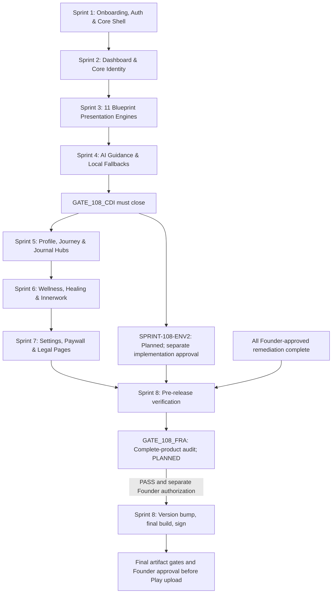

# BUILD 108 ENL — IMPLEMENTATION SPRINT PLAN
**Data-Driven Page & Surface Implementation Roadmap**

```text
STATUS                          = GATE_108_CDI CLOSED — SPRINTS 1–6 COMPLETE · SPRINT 7 PENDING FOUNDER REVIEW
PRODUCTION_BASELINE             = BUILD 107 (versionCode 107, versionName 5.0.7)
BASELINE_COMMIT                 = d2ecb5ed73b7bb5e95415be314305f3512533752
DERIVED_SPRINT_COUNT            = 8 NUMBERED SPRINTS + ENV2 (+ 1 pre-Sprint-5 data-integrity gate)
SPRINTS_COMPLETE               = 1, 2, 3, 4, 5, 6
BUILD_108_ENL_IMPLEMENTATION_STATUS = IN_PROGRESS
GATE_108_CDI                    = CLOSED
CDI_BLOCKERS_OPEN              = 0
SPRINT_108_05                  = COMPLETE
SPRINT_108_06                  = COMPLETE
SPRINT_108_ENV2                 = PLANNED
GATE_108_FRA                    = PLANNED
BUILD_108_CAN_PROCEED_TO_RELEASE = NO
NEXT_SAFE_ACTION                = STOP_FOR_FOUNDER_REVIEW
RELEASE_GATE                    = FOUNDER_SIGN_OFF_REQUIRED
```

> **CORE DATA INTEGRITY GATE — READY_TO_CLOSE (final disposition 2026-09-07).** Sprints 1–4 are
> complete; Sprint 5 unblocks the moment the Founder ratifies `GATE_108_CDI` closure. Root causes
> for the three confirmed production defects are CONFIRMED, **Founder-approved**, and
> **dispositioned in CDI audit §G**. **CDI-108-01 (Chiron), CDI-108-01A (timezone), and CDI-108-02
> (HD client integrity / recovery safety, §B.11) are done. CDI-108-03 (Schumann) is D1 APPROVED —
> `ACCEPTED_UNAVAILABLE` / fail-closed PASS; `SCHUMANN_API_URL` unchanged; future live-source
> research → `SPRINT-108-ENV2`.** `CDI_BLOCKERS_OPEN = 0`. Remaining items are ACCEPTED_DEFERRED /
> REQUIRES_FOUNDER_OPS / POST_RELEASE_BACKFILL — none blocks gate closure. No production data has
> been read or written; no backend deploy; no implementation/backfill under the disposition task.

---

## 1. Sprint Architecture Overview

The 8 implementation sprints are derived directly from the findings of the 51-route audit in `BUILD_108_ENL_PAGE_AUDIT.md`. Sprints are structured by surface dependencies, ensuring foundational systems (auth, navigation, core shell) are completed before presentation engines, AI prompts, and feature hubs:



ENV2 is an additional named sprint approved for planning on 2026-09-07. It follows CDI closure
and precedes final release; prefer execution before/alongside subsequent Environment-related
product work. The diagram expresses dependencies, not permission to implement. Sprints 5–8 keep
their existing numbering and scope. Do not reopen completed CDI work or Sprint 2 to schedule ENV2.

---

## 2. Sprint Specifications

### SPRINT 1: Onboarding, Authentication & Core Shell
- **SPRINT_ID:** `SPRINT-108-01-SHELL`
- **PAGES:**
  - `app/page.tsx` (Landing / Welcome)
  - `app/login/page.tsx` (Login)
  - `app/setup/page.tsx` (Onboarding Wizard)
- **CURRENT_GAPS:**
  - Landing tagline and CTA buttons are hardcoded Indonesian.
  - Language switcher exposed on Landing page.
  - Firebase auth errors and toasts render Indonesian text.
  - Setup validation errors and blueprint loading overlay are Indonesian.
- **TARGET:**
  - Connect `app/page.tsx` to `t.welcome`.
  - Enforce `NEXT_PUBLIC_APP_EDITION=ENL` flag to hide language switcher in ENL mode.
  - Fully localize `app/login/page.tsx` errors into English.
  - Fully localize `app/setup/page.tsx` wizard and city autocomplete into English.
- **DEPENDENCIES:**
  - `src/locales/en-US/translation.json`
  - `components/ui/CityAutocomplete`
  - `lib/auth/landingCtaRoute`
- **BUILD_107_GUARDS:**
  - Guard `decideLandingCtaRoute()`: Existing users must never be routed to `/setup` on profile read failure.
  - `AppNav.tsx` must maintain complete absence of Admin and Auth Diagnostics items.
- **TESTS_REQUIRED:**
  - `tests/unit/v5-auth-locale-flow.test.ts`
  - `tests/unit/build107-production-surface-guard.test.ts`
- **ACCEPTANCE_CRITERIA:**
  - Landing, login, and setup flow present 100% fluent English.
  - Zero Indonesian text during onboarding.
- **EXIT_GATE:** Automated tests pass; manual inspection of setup flow on mobile viewport.

---

### SPRINT 2: Dashboard & Core Identity
- **SPRINT_ID:** `SPRINT-108-02-DASHBOARD`
- **PAGES:**
  - `app/dashboard/page.tsx` (Main Dashboard)
  - `app/dashboard/environment/page.tsx` (Environment Context)
- **CURRENT_GAPS:**
  - `CoreIdentity.tsx` renders Indonesian fallback text (`"Belum tersedia"`).
  - Subcards (`DailyNoteV2.tsx`, `AIReminderState.tsx`, `WeeklyGuidanceCard.tsx`, `PenjagaBhumiIntiBanner.tsx`) contain hardcoded Indonesian text.
  - Schumann resonance interpretations and astrological weather cards are mixed.
- **TARGET:**
  - Wire all 15 dashboard cards and subcomponents to `src/locales/en-US/translation.json`.
  - Update `CoreIdentity.tsx` fallback text to English while preserving HD convergence.
  - Localize Environment context and Schumann resonance frequency descriptions.
- **DEPENDENCIES:**
  - `components/dashboard/*`
  - `lib/humandesign/hdState`
  - `lib/mappers/userProfileMapper`
- **BUILD_107_GUARDS:**
  - **CRITICAL:** Preserve Build 107 Human Design convergence fix in `CoreIdentity.tsx`. Recognized HD types must immediately resolve; failed recalculation must never overwrite canonical type.
  - `AccuracyUpgradeBanner.tsx` and `PendingHdRecoveryBanner.tsx` must guard blueprint writes on `isCanonicalHumanDesign()`.
- **TESTS_REQUIRED:**
  - `tests/unit/build107-hd-existing-user-convergence.test.ts` (19/19 must pass).
  - `tests/unit/build106-ds-ai1-ai-locale-attribution.test.ts`.
- **ACCEPTANCE_CRITERIA:**
  - Dashboard loads with 100% English card labels, buttons, and status indicators.
  - Existing user HD types render without recalculation loops.
- **EXIT_GATE:** `build107-hd-existing-user-convergence.test.ts` PASS 19/19; zero Indonesian words on dashboard.

---

### SPRINT 3: The 11 Blueprint Presentation Engines & Detail Pages
- **SPRINT_ID:** `SPRINT-108-03-BLUEPRINTS`
- **STATUS:** `COMPLETED` (Verified with `tests/unit/build108-sprint03-blueprints.test.ts` 171 assertions PASS, repository `npx tsc --noEmit` exit 0, zero calculation engine modifications)
- **PAGES:**
  - `app/blueprint/page.tsx` (Blueprint Hub)
  - `app/blueprint/numerology/page.tsx` (Life Path)
  - `app/blueprint/human-design/page.tsx` (Human Design)
  - `app/blueprint/natal-chart/page.tsx` (Natal Chart)
  - `app/blueprint/destiny-matrix/page.tsx` (Destiny Matrix)
  - `app/blueprint/vedic/page.tsx` (Vedic Astrology)
  - `app/blueprint/bazi/page.tsx` (BaZi)
  - `app/blueprint/tzolkin/page.tsx` (Tzolkin)
  - `app/blueprint/weton/page.tsx` (Weton / Javanese Systems)
  - `app/blueprint/whole-sign/page.tsx` (Whole Sign)
  - `app/blueprint/zi-wei/page.tsx` (Zi Wei Dou Shu)
  - `app/blueprint/astrocartography/page.tsx` (Astrocartography)
- **CURRENT_GAPS:**
  - `RESOLVED` — All 11 blueprint engines in `lib/` updated to accept `locale: "en" | "id"` or dual-language presentation options and generate fluent English interpretations.
  - `RESOLVED` — All 11 blueprint pages render English headings, section titles, fallbacks, and conclusions.
- **TARGET:**
  - Augment all 11 presentation files in `lib/` to accept a `locale: "en" | "id"` parameter and produce fluent English interpretations.
  - Add English dictionaries for Life Path traits, Human Design Centers/Gates, 22 Arcana definitions, Nakshatras, Solar Seals, and Day Masters.
  - For `weton/page.tsx`: strictly preserve authentic Javanese terms (*Legi, Pahing, Pon, Wage, Kliwon, Neptu, Pancasuda*) while translating all surrounding explanations into English.
- **DEPENDENCIES:**
  - `lib/numerology/presentation.ts` & `lib/data/numerology.ts`
  - `lib/humandesign/presentation.ts`
  - `lib/astrology/presentation.ts`
  - `lib/destiny-matrix/presentation.ts`
  - `lib/vedic/presentation.ts`
  - `lib/bazi/baziMeaning.ts`
  - `lib/tzolkin/presentation.ts`
  - `lib/weton/presentation.ts`
  - `lib/whole-sign/presentation.ts`
  - `lib/zi-wei/presentation.ts`
  - `lib/astrocartography/presentation.ts`
- **BUILD_107_GUARDS:**
  - Zero modification to mathematical calculation routines (`calculateHumanDesign.ts`, `calculateNatalBasics.ts`, `calculateNumerology.ts`, etc.) — VERIFIED 0 modified.
- **TESTS_REQUIRED:**
  - Unit tests for each blueprint presentation engine verifying English output when `locale === "en"` (`tests/unit/build108-sprint03-blueprints.test.ts` 171 assertions).
- **ACCEPTANCE_CRITERIA:**
  - Every blueprint page renders fluent, dignified English readings and interpretations.
  - Cultural terminology is preserved with clear English glosses.
- **EXIT_GATE:** All 11 blueprint pages verified 100% English; no calculation regressions. ALL GATES PASSED.

---

### SPRINT 4: AI Daily Guidance, Prompts & Local Fallbacks
- **SPRINT_ID:** `SPRINT-108-04-AI-GUIDANCE`
- **PAGES:**
  - AI generation endpoints and prompts driving Dashboard, Journal, and Innerwork.
- **CURRENT_GAPS:**
  - `dailyGuidancePrompt.ts` contains Indonesian boilerplate instructions and sign-offs.
  - `bhumiSoulMirrorPrompt.ts` and `bhumiManifestationPrompt.ts` contain Indonesian framing.
  - `localDailyGuidanceFallback.ts` contains mixed Indonesian fallback prose.
  - `timeOfDayGreeting.ts` produces Indonesian greetings.
- **TARGET:**
  - Refactor all AI prompt builders to enforce pure English output when `language === "en"`.
  - Replace *"Halo {firstName}"* with *"Welcome, {firstName}"* or natural time-of-day greetings.
  - Replace *"Peluk hangat dari Bhumi."* with dignified English companion sign-offs (*"Warmly with you, Bhumi."*).
  - Complete 100% of English fallback strings in `localDailyGuidanceFallback.ts`.
  - Ensure `/api/ai/daily-guidance` endpoint normalizes and passes `language: "en"`.
- **DEPENDENCIES:**
  - `lib/prompts/*`
  - `lib/dailyGuidance/*`
  - `lib/orchestrators/localDailyGuidanceFallback.ts`
  - `app/api/ai/daily-guidance/route.ts`
- **BUILD_107_GUARDS:**
  - Retain strict non-clinical, non-diagnostic safety boundaries and companion voice archetype.
- **TESTS_REQUIRED:**
  - `tests/unit/build106-ds-ai1-ai-locale-attribution.test.ts`
  - Unit tests for English deterministic fallback generation.
- **ACCEPTANCE_CRITERIA:**
  - Daily guidance generated via AI returns 100% fluent English.
  - Offline/fallback guidance returns 100% fluent English.
- **EXIT_GATE:** AI and fallback test suite PASS; zero Indonesian output when `language: "en"`. ALL GATES PASSED.
- **STATUS:** COMPLETE (129/129 unit tests passing, zero Indonesian leakage in ENL mode).

---

### GATE-CDI: Core Data Integrity Gate (between Sprint 4 and Sprint 5)
- **GATE_ID:** `GATE-108-CDI`
- **STATUS:** `READY_TO_CLOSE — FOUNDER RATIFICATION PENDING` (final disposition 2026-09-07, CDI audit §G). Root-cause audit **Founder-approved** (`BUILD_108_CORE_DATA_INTEGRITY_AUDIT.md`). **CDI-108-01 (Chiron) DONE. CDI-108-01A (timezone) DONE. CDI-108-02 (HD client integrity / recovery safety) DONE (§B.11). CDI-108-03 (Schumann) — D1 APPROVED, `ACCEPTED_UNAVAILABLE` / fail-closed PASS.** `CDI_BLOCKERS_OPEN = 0`. Remaining items: ACCEPTED_DEFERRED / REQUIRES_FOUNDER_OPS / POST_RELEASE_BACKFILL — none blocks closure.
- **TRIGGER:** Founder confirmed three production data-integrity defects from real users that Build 108 must not inherit.
- **WORK ITEMS:**
  - **CDI-108-01 — Chiron / natal accuracy — ✅ DONE (2026-09-06).** Removed `calculateApproximateChironLongitude` (linear model) and `buildApproximatePlacidusHouses` (Equal-house-as-Placidus). Added a committed Swiss Ephemeris Chiron table (`lib/astrology/data/chironEphemeris.json`, 1900–2100, 7-day samples; `lib/astrology/chironEphemeris.ts`, Catmull-Rom, validated max error 0.00083°). Local engine now emits genuine Whole Sign houses only + `houseSystem` label + `chironAccuracy` contract (never `"ephemeris"` from an approximation). Added `lib/config/astrologyApiUrl.ts` + `app/api/humandesign/astrology/route.ts` (Vercel proxy → configured Swiss Ephemeris service; fails closed with an explicit `calculationStatus`). `calculateNatalBasicsAsync` routes via `getAstrologyApiUrl()` with a Firebase auth header + bounded timeout; on ANY remote failure keeps the local chart (accurate table Chiron + genuine Whole Sign), never synthesising Placidus. `generateBlueprint` / `blueprintRecoveryEngine` persist `chiron` only when ephemeris-accurate and `placidusHouses` only when genuine — otherwise the field is undefined → `sanitizeForFirestore` drops it → `{merge:true}` preserves the stored value. Fixtures: `tests/fixtures/build108-cdi01-chiron-reference.json`; test `tests/unit/build108-cdi01-chiron-natal-accuracy.test.ts` (13 checks, EXIT 0). Old linear model: 8/10 wrong sign, max 78.65° error; new table: 12/12 correct. `tsc` EXIT 0; Build 107 guards 19/19 + 131/131. → **CDI-C1 DONE** (real ephemeris for Chiron; routing/config + honest Placidus/Whole-Sign separation; ephemeris SERVICE still needs deployment with `/calculate-astrology` for genuine Placidus — Founder/ops step, Chiron unaffected). **CDI-C2 DONE** (fail-closed provenance markers + declared-system label; stored Chiron preserved).
  - **CDI-108-01A — timezone canonicalization — ✅ DONE (2026-09-06).** Removed `Math.round(longitude / 15)` + browser-guess (`new Date().getTimezoneOffset()`) + `+07:00` default from setup / settings / `resolveNatalLocation` / recovery. New `lib/astrology/resolveIanaTimezone.ts`: deterministic offline lat/lon → IANA (`tz-lookup@6.1.25`, CC0, ~152 KB, zero deps); `canonicalizeNatalTimezone` keeps a valid stored IANA / `+HH:MM` value (never overwrites) → else geo-resolves → else `null` (fail closed to pending). `toUtcDate` now uses **luxon** for DST-correct IANA wall-clock → UTC. `CITY_FALLBACKS` upgraded to IANA names. Profile schema unchanged (`timezone?: string\|null`) — backward-compatible; `timezoneSource` union += `iana-geo`/`stored`/`unresolved`. Fixture generator derives fixture zones from `timezonefinder` (found + fixed a hand-labelled wrong zone: Denpasar was `Asia/Jakarta`, is `Asia/Makassar`); +2 fixtures (Kathmandu +5:45, Indiana). Test `tests/unit/build108-cdi01a-timezone-canonicalization.test.ts` (10 checks, EXIT 0). **CHIRON_END_TO_END_MAX_ERROR = 0.000420° (12/12 fixtures; target < 0.01° met by ~24×).** → **CDI-C3 DONE.**
  - **CDI-108-02 — Human Design advanced variables — REFINED READ-ONLY AUDIT DONE (audit §B.8); IMPLEMENTATION NOT STARTED.** The *deployed* engine (verified via synthetic POST 2026-09-06) DOES return top-level `digestion:"Active"` / `environment:"Observer"` / `motivation:"Receptive"` (arrow `def_type`) + `cognition:"Outer Vision"` (6-fold) + `variables.short_code:"PRR DLR"`; the adapter / normalizer / persistence / the "Advanced Variables" grid keys handle these correctly. **Confirmed defects:** (a) `perspective` — adapter reads an absent top-level key instead of `variables.bottom_right` (derivable, affects new users); (b) "Variables Arrows" — `HumanDesignBodygraphLite.tsx:203` reads `variables.variable \|\| variables.value` instead of stored `variables.short_code` (UI-only); (c) per-planet Color/Tone/Base — the deployed engine never emits a `diagnostic` block and IGNORES `debug` (needs another engine); (d) "Not stored" for the present fields on real users = **legacy blueprints** (local migration from stored `variables.<arrow>.def_type`, else re-fetch; `cognition` = re-fetch only); (e) `mass-recover-hd.ts` still corrupts `centers` (raw array) + drops activations/`openCenters`; (f) no explicit `perspective:` coercion in `normalizeBlueprint`; (g) HD variable/style narratives Indonesian-only; (h) "Story… being prepared." on CANONICAL types. HD **core** identity healthy; Build 107 convergence intact. → **CDI-B1** (perspective derive), **CDI-B2** (short_code UI key), **CDI-B3** (normalizer + mass-recover shape), **CDI-B4** (narrative i18n), **CDI-B5** (presentation gating), **CDI-B6** (Color/Tone/Base — needs a diagnostic-emitting engine, CDI-C1 class).
  - **CDI-108-03 — Schumann source — RESEARCH + ARCHITECTURE DECISION DONE (2026-09-07); NO QUALIFYING SOURCE; FOUNDER DECISION REQUIRED.** Full report: `BUILD_108_CDI_108_03_SCHUMANN_SOURCE_RESTORATION.md`. Read-only probes: incumbent `schumannresonancelive.com/api/data.php` still **404** (all JSON paths removed); its successor `/realtime/*.php` is a **JPEG-only** re-render of the Tomsk spectrogram; the true Tomsk upstream (`sosrff.tsu.ru`) has an **expired TLS cert** and no JSON; HeartMath GCMS `power_levels.php` is CORS-open but returns empty `[[0]]`, measures **broadband band power (not SR peaks)**, has no provenance fields, no open-data licence, and its live-data page was removed; `gci-api.com` is DNS-dead; other candidates are commercial apps / NOAA-derived / hobbyist. **`QUALIFYING_SOURCE_FOUND = NO`** → **Option A (direct client swap) impossible**; Options B/C (proxy / ingestion) need a Founder-gated backend + licensing review + (Tomsk route) reviewed spectral-peak extraction — a real project, best folded into ENV2. **No fabricated "healthy" values** — `Aktivitas Bumi = Stabil` / `Geomagnetik = Tenang` remain genuine USGS/NOAA readings, guarded on `dataState`/`source.status === "available"`. `SCHUMANN_API_URL` unchanged. → **CDI-A1** research done, blocked (no source). **CDI-A2** blocked on CDI-A1 + backend authz. **CDI-A3 DONE** — honest-unavailable UI + `deriveEnvironmentBands`/`hasSchumannObservation` gate preserved and regression-locked (`tests/unit/build108-cdi03-schumann-source-integrity.test.ts`, 16 checks). **Founder decision — D1** accept fail-closed (FRA: SCHUMANN = DEFERRED w/ rationale) · **D2** authorize a separate backend-gated ENV2 restoration project · **D3** provide a private licensed provider.
  - **CDI-D1 — Cross-user / legacy.** Post-fix, non-destructive, convergence-safe production **backfill** for HD advanced variables + Chiron across Build 103–107 cohorts. Founder-authorised and executed **separately**; not part of this gate's code work; **not authorised now**.
- **BUILD_107_GUARDS:** every `CDI-*` fix must leave the Build 107 inheritance checklist (`BUILD_108_ENL_MASTER_SOT.md §3`) 100% intact — especially: a failed HD recalculation must never overwrite a CANONICAL stored `type`. Verified for CDI-108-01 + CDI-108-01A.
- **CURRENT DISPOSITION (final, 2026-09-07 — CDI audit §G):** the pre-fix CDI-108-02 findings above
  are historical; §B.11 records completed client integrity/recovery safety. **CDI-108-03 = D1
  APPROVED — `ACCEPTED_UNAVAILABLE` / fail-closed PASS; `SCHUMANN_API_URL` unchanged; future
  live-source research → `SPRINT-108-ENV2`.** `CDI_BLOCKERS_OPEN = 0`. Remaining items and their
  classification:
  - **ACCEPTED_DEFERRED:** HD Cognition legacy re-fetch (new-user PASS) · HD Color/Tone/Base
    (honest source-unavailable) · HD service runtime validation (Sprint 8 / `GATE_108_FRA §3.8`) ·
    Schumann live-source restoration (`SPRINT-108-ENV2`).
  - **REQUIRES_FOUNDER_OPS:** genuine Placidus service deployment (CDI-C1 residual) ·
    diagnostic-emitting HD engine for per-planet Color/Tone/Base.
  - **POST_RELEASE_BACKFILL (CDI-D1, separately Founder-authorized only):** HD legacy
    advanced-variable backfill · legacy natal Chiron/timezone backfill.
- **EXIT_GATE:** Founder ratification of `GATE_108_CDI` closure (`READY_TO_CLOSE`,
  `CDI_BLOCKERS_OPEN = 0`) → `SPRINT-108-05` resumes. Closure does **not** authorize release, ops
  deployment, or backfill; those retain their own gates (`GATE_108_FRA`, CDI-C1 ops, CDI-D1).

---

### SPRINT 5: Profile, Journey & Journal Hubs
- **SPRINT_ID:** `SPRINT-108-05-PROFILE-JOURNEY-JOURNAL`
- **STATUS:** `BLOCKED` — cannot start until `GATE-108-CDI` is dispositioned by the Founder.
- **PAGES:**
  - `app/profile/page.tsx` (Profile Hub)
  - `app/profile/[section]/page.tsx` (Profile Section Detail)
  - `app/journey/page.tsx` (Journey Roadmap)
  - `app/journey/[id]/page.tsx` (Journey Stage Detail)
  - `app/journal/page.tsx` (Journaling Interface)
  - `app/insights/page.tsx` (Insights Archive)
  - `app/reports/weekly/page.tsx` (Weekly Reports)
- **CURRENT_GAPS:**
  - Profile Hub and tabs render 100% hardcoded Indonesian text.
  - Journey roadmap and stage checklists are hardcoded Indonesian.
  - Journal prompt cards, mood check-in chips, and timeline history are hardcoded Indonesian.
  - Weekly report templates are Indonesian.
- **TARGET:**
  - Wire Profile Hub and tabs to `t.profile`.
  - Expand `t.journey` and migrate Journey roadmap cards to English.
  - Connect Journaling page and subcards to `t.journaling`.
  - Localize Insights archive and Weekly report templates into English.
- **DEPENDENCIES:**
  - `components/profile/*`
  - `components/journey/*`
  - `components/journal/*`
  - `lib/repositories/journalRepository`
- **BUILD_107_GUARDS:**
  - Preserve journal persistence schema, encrypted text storage, and owner isolation.
- **TESTS_REQUIRED:**
  - Release test suite for journal and profile persistence (`test:release`).
- **ACCEPTANCE_CRITERIA:**
  - Profile, Journey, Journal, Insights, and Weekly Reports render 100% English copy.
  - Historical journal entries are safely preserved.
- **EXIT_GATE:** All 7 hub pages verified 100% English.

---

### SPRINT 6: Wellness, Somatics, Healing & Innerwork
- **SPRINT_ID:** `SPRINT-108-06-WELLNESS-HEALING-INNERWORK`
- **PAGES:**
  - `app/wellness/page.tsx` (Wellness Dashboard)
  - `app/wellness-assessment/page.tsx` (Wellness Assessment Questionnaire)
  - `app/meditation/page.tsx` (Meditation Hub)
  - `app/healing/page.tsx` (Healing Hub)
  - `app/healing/audio/page.tsx` (Frequency Sound Therapy)
  - `app/healing/meditation/page.tsx` (Guided Healing Sessions)
  - `app/innerwork/page.tsx` (Innerwork Hub)
  - `app/innerwork/audio-healing/page.tsx`
  - `app/innerwork/herbal/page.tsx`
  - `app/innerwork/journaling/page.tsx`
  - `app/innerwork/manifestasi/page.tsx`
  - `app/innerwork/meditation/page.tsx`
  - `app/innerwork/workout/page.tsx`
  - `app/innerwork/yoga/page.tsx`
  - `app/kenali-diri/aura/page.tsx`
- **CURRENT_GAPS:**
  - 25 wellness assessment questions and options are hardcoded Indonesian.
  - 11 Healing and Innerwork subpages render hardcoded Indonesian instructions, recipes, and practices.
  - Aura calculation API and page return Indonesian interpretations.
- **TARGET:**
  - Translate all 25 wellness assessment questions, scales, and feedback screens into English.
  - Localize all Healing and Innerwork pages, exercises, breathwork cues, and herbal recipes.
  - Localize Aura resonance reading and API response.
- **DEPENDENCIES:**
  - `components/wellness/*`
  - `components/healing/*`
  - `lib/innerwork/*`
  - `app/api/kenali-diri/aura/route.ts`
- **BUILD_107_GUARDS:**
  - Preserve audio playback functionality, Capacitor media plugins, and timer state machines.
- **TESTS_REQUIRED:**
  - `tests/unit/build107-production-surface-guard.test.ts`
- **ACCEPTANCE_CRITERIA:**
  - All 15 somatic, wellness, and healing pages render 100% English.
  - Assessment questionnaire flows smoothly in English.
- **EXIT_GATE:** All 15 pages verified 100% English.

---

### SPRINT 7: Settings, Paywall, Legal & Static Pages
- **SPRINT_ID:** `SPRINT-108-07-SETTINGS-LEGAL-PAYWALL`
- **PAGES:**
  - `app/inbox/page.tsx` (Inbox & Notifications)
  - `app/settings/page.tsx` (Settings & Account)
  - `app/premium-bhumi/page.tsx` (Paywall & Plans)
  - `app/upgrade/page.tsx` (Feature Upgrade)
  - `app/tentang/page.tsx` (About Us)
  - `app/syarat-ketentuan/page.tsx` (Terms of Service)
  - `app/kebijakan-privasi/page.tsx` (Privacy Policy)
  - `app/bantuan/page.tsx` (Help Center)
  - `app/kontak/page.tsx` (Contact Us)
- **CURRENT_GAPS:**
  - All 5 legal and static pages are 100% hardcoded Indonesian text.
  - Settings page contains Indonesian text in Danger Zone, Account Deletion, and `toDisplayDate()`.
  - Paywall page contains Indonesian disclaimers and pricing formats.
- **TARGET:**
  - Provide complete, dignified English translations for About Us, Terms of Service, Privacy Policy, Help Center, and Contact Us.
  - Localize Settings Danger Zone and Account Deletion flow into English.
  - Replace hardcoded `"id-ID"` in `toDisplayDate()` with dynamic locale formatting.
  - Localize paywall pricing and subscription disclaimers.
- **DEPENDENCIES:**
  - `lib/data/translations`
  - `lib/billing/*`
  - `components/billing/*`
- **BUILD_107_GUARDS:**
  - **CRITICAL:** Preserve Google Play Billing integration, entitlement service, and the four admin Lifetime accounts (`adminRoleRegistry.ts`, `privilegedUser.ts`).
  - Preserve account deletion execution and Firestore purge security.
- **TESTS_REQUIRED:**
  - `build106-admin-lifetime-continuity.test.ts`
  - Billing release test suite.
- **ACCEPTANCE_CRITERIA:**
  - Legal, Settings, Paywall, and Help pages render 100% English.
  - Zero Indonesian text on any remaining product route.
- **EXIT_GATE:** Legal and settings test suite PASS; billing behavior verified intact.

---

### SPRINT-108-ENV2: Environmental Intelligence v2

- **SPRINT_ID:** `SPRINT-108-ENV2`
- **STATUS:** `SPRINT_108_ENV2 = PLANNED` — scope/documentation approved; implementation NOT authorized.
- **POSITION:** After `GATE_108_CDI` closes; before final Build 108 release. Prefer before/alongside
  subsequent Environment-related product work. No renumbering of Sprints 5–8 or reopening of
  completed CDI items.
- **PRODUCT SCOPE:** Dashboard Atmosphere & Volcanic card; Environment detail section/page;
  trend/timeline only if historical data supports it; map/plume visualization only if licensed,
  reliable spatial data supports it.
- **DATA DOMAINS:** Surface air quality (AQI, PM2.5, PM10, NO2, O3, CO, surface SO2); atmospheric
  total-column SO2; wind speed/direction/movement relative to user location; volcanic context
  (`plumeDetected`, `probableVolcanicOrigin`, `probableSource`, `attributionConfidence`).
- **CONTRACT:** Design `EnvironmentalConditionPayload` with `airQuality`, `atmosphere`, `wind`,
  `volcanic`, `provenance`, `freshness`, `updatedAt`, following `MASTER_SOT §4.3`. Every datum
  carries/resolves SOURCE, OBSERVED_AT, FETCHED_AT, FRESHNESS, QUALITY, PROVENANCE. Retain original
  scientific units, spatial/temporal context, AQI standard, and measured/modelled/forecast identity.

**Research phase — required before any implementation:**

1. Evaluate authoritative/measurement-backed providers separately for surface air quality,
   atmospheric SO2 column, wind, and volcanic activity/plume context. No provider is selected here.
2. For each candidate record SOURCE, DATASET, MEASUREMENT_TYPE, SPATIAL_RESOLUTION,
   TEMPORAL_RESOLUTION, HISTORY_AVAILABLE, HTTPS, API, CORS, RATE_LIMIT, LICENSING,
   ANDROID_COMPATIBILITY, PROVENANCE, RELIABILITY, VERDICT. Unknowns remain explicitly unverified.
   Windy screenshots/visualization cannot be Bhumi's canonical data source.
3. Compare direct client APIs, a Bhumi environmental proxy, scheduled ingestion/cache, and hybrid
   designs. Prefer provider changes isolated from the Android client. Verify static Next export,
   Capacitor HTTPS/CORS, rate limits, access terms, dataset freshness, cache expiry, failures,
   source replacement, and location-data handling. Backend need remains undetermined.
4. Define dataset-specific freshness/quality acceptance and a conservative attribution method
   before implementation; present a reviewable architecture with evidence and open limitations.
   No external/paid provider commitment or backend deployment is authorized.

**Implementation acceptance criteria (future work, not executed tests):**

- Keep `SURFACE_SO2`, `ATMOSPHERIC_COLUMN_SO2`, `VOLCANIC_ATTRIBUTION` distinct; never derive one
  from another. Column SO2 retains its original scientific unit and cannot imply personal exposure.
- SO2 alone never establishes volcanic origin. Attribution uses supported plume location/geometry,
  wind trajectory, source location, timing, and observation provenance. With insufficient evidence,
  `probableSource = null`; unknown detection/origin/confidence is explicit. Never fabricate Normal,
  Stable, Safe, Volcanic plume detected, or a source volcano.
- No Schumann, NOAA Kp, earthquake, weather, or generic geomagnetic substitution for SO2/plumes.
- Conservative surface air-quality advice uses relevant surface observations/established AQI.
  Cultural/spiritual content is separated from measured facts. ENL copy is native English,
  including unavailable, unknown, error, stale, and partial states; multilingual behavior persists.
- Deterministic tests must cover valid/partial/malformed/missing data, original units, datum-level
  provenance persistence, timestamps/forecast identity, timeout/provider errors, fresh/stale/no
  cache, temporal/spatial mismatch, history gaps, and independent domain failures.
- Attribution tests must cover SO2-only input, weak/conflicting/missing/old evidence (null source),
  and evidence-supported positive cases, plus NOAA/USGS/Schumann isolation and prohibited health
  claims. Do not equate a green unit suite with observed provider or UI correctness.
- Verify actual provider contracts and rendered Dashboard/detail states, including Android/static
  export, failures, provenance/freshness, and any conditional timeline/map. Run Build 107 HD and
  production-surface guards, Chiron/timezone/HD CDI tests, Environment regressions, TSC, and relevant
  release suites. Completed CDI logic, admin/diagnostics removal, security, and billing stay intact.

**EXIT GATE:** source/terms and architecture evidence accepted; authorized implementation meets
the above pre-artifact checks and applicable ENV2 acceptance requirements in release Gates 1–5.
Final artifact verification (Gate 6) and publication approval (Gate 7) follow FRA; they are not
prerequisites for ENV2 implementation completion. Unsupported optional
timeline/map stays explicitly unavailable/omitted; unresolved mandatory scope requires Founder
disposition before release. Planning approval cannot satisfy implementation or release gates.

`NEXT_SAFE_ACTION = FOUNDER_RATIFY_GATE_108_CDI_CLOSURE -> RESUME SPRINT-108-05`. Do not implement ENV2 yet.

---

### SPRINT 8: Final Regression, Build Verification & Release Protocol
- **SPRINT_ID:** `SPRINT-108-08-RELEASE-QA`
- **CURRENT GATE STATE:** `GATE_108_FRA = PLANNED`; `BUILD_108_CAN_PROCEED_TO_RELEASE = NO`.
  Do not execute the final audit or release actions yet.
- **PAGES:**
  - Repository-wide verification across all 51 routes.
- **CURRENT_GAPS:**
  - Unsynchronized version identifiers (`versionCode = 107`, `versionName = "5.0.7"`).
  - Release artifacts not yet generated.
- **TARGET — PRE-RELEASE VERIFICATION PHASE:**
  - Execute full repository-wide TypeScript verification (`npx tsc --noEmit`).
  - Run full release test suite (`npm run test:release`).
  - Run automated regex scan confirming 0 hardcoded Indonesian strings on visible surfaces.
  - After all implementation sprints, CDI closure, ENV2, and all approved remediation, execute
    the mandatory complete-product `GATE_108_FRA` protocol in `BUILD_108_FINAL_RELEASE_AUDIT.md`.
    It covers all 11 domains, every requirement/route/child surface, test AND actual runtime
    evidence, source ancestry/worktree, and the full final report. Targets: UNKNOWN=0,
    UNACCOUNTED=0, FALSE_PASS=0, zero ID/MS application-copy leakage and no release-critical gaps.
  - Only FRA PASS unlocks eligibility for the following separately authorized release phase.
- **TARGET — RELEASE PHASE (FRA PASS + EXPLICIT FOUNDER AUTHORIZATION REQUIRED):**
  - Atomically bump versions across `build.gradle`, `buildInfo.ts`, `version.ts`, and tests:
    - `versionCode = 108`
    - `versionName = "5.0.8"`
  - Run deterministic production build: `node scripts/run-prod-build.mjs`.
  - Execute bundle security guard: `tsx scripts/guard-release-bundle.ts`.
  - Sync Capacitor and generate release-signed AAB and APK.
  - Record hashes, byte counts, and test logs.
  - Stop and request Founder Final Sign-Off.
- **DEPENDENCIES:**
  - Android SDK, JDK 17, production keystore properties.
  - All implementation sprints, `GATE_108_CDI`, ENV2, and Founder-approved remediation complete
    before FRA. ENV2 remains PLANNED until separate implementation authorization.
- **BUILD_107_GUARDS:**
  - Complete verification of all 8 items on the `BUILD_107_INHERITANCE_CHECKLIST`.
- **TESTS_REQUIRED:**
  - Full emulator test suite (29+ test files, 0 failures).
  - `build107-production-surface-guard.test.ts` (131/131 PASS).
  - `build107-hd-existing-user-convergence.test.ts` (19/19 PASS).
  - `version-reconciliation.test.ts` (107 / 5.0.7 before FRA; retargeted to 108 / 5.0.8 only in
    the authorized post-FRA release bump, then rerun against that source).
- **ACCEPTANCE_CRITERIA:**
  - FRA PASS at the audited pre-version source HEAD before bump/build/sign; a later source change
    requires evidence impact review and revalidation. No earlier sprint result substitutes for FRA.
  - All 7 Release Gates in `BUILD_108_ENL_RELEASE_PLAN.md` are satisfied in their proper phase;
    artifact/signing and final publication approval follow FRA, never count as pre-executed proof.
  - Zero warnings or errors in production build.
- **EXIT_GATE:** FRA PASS, final artifact evidence, and Founder explicit release sign-off.

---

## 3. Governance Invariant

```text
BUILD_108_ENL_IMPLEMENTATION_STATUS = PAUSED_FOR_CORE_DATA_INTEGRITY
SPRINTS_COMPLETE               = 1, 2, 3, 4
GATE_108_CDI                   = READY_TO_CLOSE — FOUNDER RATIFICATION PENDING (CDI_BLOCKERS_OPEN = 0; CDI audit §G); CDI-108-03 = D1 ACCEPTED_UNAVAILABLE
SPRINT_5                       = BLOCKED (unblocks on GATE_108_CDI closure ratification)
SPRINT_108_ENV2                 = PLANNED
GATE_108_FRA                    = PLANNED
BUILD_108_CAN_PROCEED_TO_RELEASE = NO
NEXT_SAFE_ACTION                = FOUNDER_RATIFY_GATE_108_CDI_CLOSURE -> RESUME SPRINT-108-05
```

**MANDATORY RULES:**
- No Sprint 5+ execution until the Founder ratifies `GATE-108-CDI` closure
  (`READY_TO_CLOSE`, `CDI_BLOCKERS_OPEN = 0`).
- Final CDI disposition (2026-09-07, CDI audit §G): completed Chiron, timezone, and HD
  client/recovery work stays done; CDI-108-03 = D1 APPROVED (`ACCEPTED_UNAVAILABLE` / fail-closed
  PASS), `SCHUMANN_API_URL` unchanged, future live-source research → `SPRINT-108-ENV2`. HD extras
  remain source-dependent; backfill NOT READY. Do not implement, deploy, or backfill anything;
  no ENV2 implementation or FRA execution is authorized.
- No production Firestore read/write; no HD/natal backfill or migration run; no version bump,
  build, sign, deploy, or upload.
- Every `CDI-*` fix must preserve 100% of the Build 107 inheritance checklist (verified for CDI-108-01).
