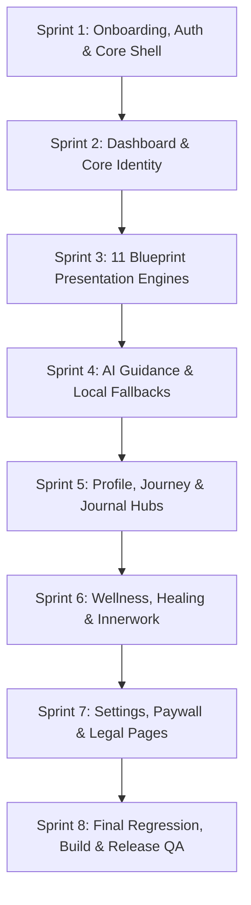

# BUILD 108 ENL — IMPLEMENTATION SPRINT PLAN
**Data-Driven Page & Surface Implementation Roadmap**

```text
STATUS                          = NOT_STARTED (PLAN DERIVED FROM READ-ONLY AUDIT)
PRODUCTION_BASELINE             = BUILD 107 (versionCode 107, versionName 5.0.7)
BASELINE_COMMIT                 = d2ecb5ed73b7bb5e95415be314305f3512533752
DERIVED_SPRINT_COUNT            = 8 SPRINTS
BUILD_108_ENL_IMPLEMENTATION_STATUS = NOT_STARTED
NEXT_SAFE_ACTION                = FOUNDER_REVIEW_OF_PAGE_AUDIT_AND_SPRINT_PLAN
RELEASE_GATE                    = FOUNDER_SIGN_OFF_REQUIRED
```

---

## 1. Sprint Architecture Overview

The 8 implementation sprints are derived directly from the findings of the 51-route audit in `BUILD_108_ENL_PAGE_AUDIT.md`. Sprints are structured by surface dependencies, ensuring foundational systems (auth, navigation, core shell) are completed before presentation engines, AI prompts, and feature hubs:



---

## 2. Sprint Specifications

### SPRINT 1: Onboarding, Authentication & Core Shell
- **SPRINT_ID:** `SPRINT-108-01-SHELL`
- **PAGES:**
  - `app/page.tsx` (Landing / Welcome)
  - `app/login/page.tsx` (Login)
  - `app/setup/page.tsx` (Onboarding Wizard)
- **CURRENT_GAPS:**
  - Landing tagline and CTA buttons are hardcoded Indonesian.
  - Language switcher exposed on Landing page.
  - Firebase auth errors and toasts render Indonesian text.
  - Setup validation errors and blueprint loading overlay are Indonesian.
- **TARGET:**
  - Connect `app/page.tsx` to `t.welcome`.
  - Enforce `NEXT_PUBLIC_APP_EDITION=ENL` flag to hide language switcher in ENL mode.
  - Fully localize `app/login/page.tsx` errors into English.
  - Fully localize `app/setup/page.tsx` wizard and city autocomplete into English.
- **DEPENDENCIES:**
  - `src/locales/en-US/translation.json`
  - `components/ui/CityAutocomplete`
  - `lib/auth/landingCtaRoute`
- **BUILD_107_GUARDS:**
  - Guard `decideLandingCtaRoute()`: Existing users must never be routed to `/setup` on profile read failure.
  - `AppNav.tsx` must maintain complete absence of Admin and Auth Diagnostics items.
- **TESTS_REQUIRED:**
  - `tests/unit/v5-auth-locale-flow.test.ts`
  - `tests/unit/build107-production-surface-guard.test.ts`
- **ACCEPTANCE_CRITERIA:**
  - Landing, login, and setup flow present 100% fluent English.
  - Zero Indonesian text during onboarding.
- **EXIT_GATE:** Automated tests pass; manual inspection of setup flow on mobile viewport.

---

### SPRINT 2: Dashboard & Core Identity
- **SPRINT_ID:** `SPRINT-108-02-DASHBOARD`
- **PAGES:**
  - `app/dashboard/page.tsx` (Main Dashboard)
  - `app/dashboard/environment/page.tsx` (Environment Context)
- **CURRENT_GAPS:**
  - `CoreIdentity.tsx` renders Indonesian fallback text (`"Belum tersedia"`).
  - Subcards (`DailyNoteV2.tsx`, `AIReminderState.tsx`, `WeeklyGuidanceCard.tsx`, `PenjagaBhumiIntiBanner.tsx`) contain hardcoded Indonesian text.
  - Schumann resonance interpretations and astrological weather cards are mixed.
- **TARGET:**
  - Wire all 15 dashboard cards and subcomponents to `src/locales/en-US/translation.json`.
  - Update `CoreIdentity.tsx` fallback text to English while preserving HD convergence.
  - Localize Environment context and Schumann resonance frequency descriptions.
- **DEPENDENCIES:**
  - `components/dashboard/*`
  - `lib/humandesign/hdState`
  - `lib/mappers/userProfileMapper`
- **BUILD_107_GUARDS:**
  - **CRITICAL:** Preserve Build 107 Human Design convergence fix in `CoreIdentity.tsx`. Recognized HD types must immediately resolve; failed recalculation must never overwrite canonical type.
  - `AccuracyUpgradeBanner.tsx` and `PendingHdRecoveryBanner.tsx` must guard blueprint writes on `isCanonicalHumanDesign()`.
- **TESTS_REQUIRED:**
  - `tests/unit/build107-hd-existing-user-convergence.test.ts` (19/19 must pass).
  - `tests/unit/build106-ds-ai1-ai-locale-attribution.test.ts`.
- **ACCEPTANCE_CRITERIA:**
  - Dashboard loads with 100% English card labels, buttons, and status indicators.
  - Existing user HD types render without recalculation loops.
- **EXIT_GATE:** `build107-hd-existing-user-convergence.test.ts` PASS 19/19; zero Indonesian words on dashboard.

---

### SPRINT 3: The 11 Blueprint Presentation Engines & Detail Pages
- **SPRINT_ID:** `SPRINT-108-03-BLUEPRINTS`
- **STATUS:** `COMPLETED` (Verified with `tests/unit/build108-sprint03-blueprints.test.ts` 171 assertions PASS, repository `npx tsc --noEmit` exit 0, zero calculation engine modifications)
- **PAGES:**
  - `app/blueprint/page.tsx` (Blueprint Hub)
  - `app/blueprint/numerology/page.tsx` (Life Path)
  - `app/blueprint/human-design/page.tsx` (Human Design)
  - `app/blueprint/natal-chart/page.tsx` (Natal Chart)
  - `app/blueprint/destiny-matrix/page.tsx` (Destiny Matrix)
  - `app/blueprint/vedic/page.tsx` (Vedic Astrology)
  - `app/blueprint/bazi/page.tsx` (BaZi)
  - `app/blueprint/tzolkin/page.tsx` (Tzolkin)
  - `app/blueprint/weton/page.tsx` (Weton / Javanese Systems)
  - `app/blueprint/whole-sign/page.tsx` (Whole Sign)
  - `app/blueprint/zi-wei/page.tsx` (Zi Wei Dou Shu)
  - `app/blueprint/astrocartography/page.tsx` (Astrocartography)
- **CURRENT_GAPS:**
  - `RESOLVED` — All 11 blueprint engines in `lib/` updated to accept `locale: "en" | "id"` or dual-language presentation options and generate fluent English interpretations.
  - `RESOLVED` — All 11 blueprint pages render English headings, section titles, fallbacks, and conclusions.
- **TARGET:**
  - Augment all 11 presentation files in `lib/` to accept a `locale: "en" | "id"` parameter and produce fluent English interpretations.
  - Add English dictionaries for Life Path traits, Human Design Centers/Gates, 22 Arcana definitions, Nakshatras, Solar Seals, and Day Masters.
  - For `weton/page.tsx`: strictly preserve authentic Javanese terms (*Legi, Pahing, Pon, Wage, Kliwon, Neptu, Pancasuda*) while translating all surrounding explanations into English.
- **DEPENDENCIES:**
  - `lib/numerology/presentation.ts` & `lib/data/numerology.ts`
  - `lib/humandesign/presentation.ts`
  - `lib/astrology/presentation.ts`
  - `lib/destiny-matrix/presentation.ts`
  - `lib/vedic/presentation.ts`
  - `lib/bazi/baziMeaning.ts`
  - `lib/tzolkin/presentation.ts`
  - `lib/weton/presentation.ts`
  - `lib/whole-sign/presentation.ts`
  - `lib/zi-wei/presentation.ts`
  - `lib/astrocartography/presentation.ts`
- **BUILD_107_GUARDS:**
  - Zero modification to mathematical calculation routines (`calculateHumanDesign.ts`, `calculateNatalBasics.ts`, `calculateNumerology.ts`, etc.) — VERIFIED 0 modified.
- **TESTS_REQUIRED:**
  - Unit tests for each blueprint presentation engine verifying English output when `locale === "en"` (`tests/unit/build108-sprint03-blueprints.test.ts` 171 assertions).
- **ACCEPTANCE_CRITERIA:**
  - Every blueprint page renders fluent, dignified English readings and interpretations.
  - Cultural terminology is preserved with clear English glosses.
- **EXIT_GATE:** All 11 blueprint pages verified 100% English; no calculation regressions. ALL GATES PASSED.

---

### SPRINT 4: AI Daily Guidance, Prompts & Local Fallbacks
- **SPRINT_ID:** `SPRINT-108-04-AI-GUIDANCE`
- **PAGES:**
  - AI generation endpoints and prompts driving Dashboard, Journal, and Innerwork.
- **CURRENT_GAPS:**
  - `dailyGuidancePrompt.ts` contains Indonesian boilerplate instructions and sign-offs.
  - `bhumiSoulMirrorPrompt.ts` and `bhumiManifestationPrompt.ts` contain Indonesian framing.
  - `localDailyGuidanceFallback.ts` contains mixed Indonesian fallback prose.
  - `timeOfDayGreeting.ts` produces Indonesian greetings.
- **TARGET:**
  - Refactor all AI prompt builders to enforce pure English output when `language === "en"`.
  - Replace *"Halo {firstName}"* with *"Welcome, {firstName}"* or natural time-of-day greetings.
  - Replace *"Peluk hangat dari Bhumi."* with dignified English companion sign-offs (*"Warmly with you, Bhumi."*).
  - Complete 100% of English fallback strings in `localDailyGuidanceFallback.ts`.
  - Ensure `/api/ai/daily-guidance` endpoint normalizes and passes `language: "en"`.
- **DEPENDENCIES:**
  - `lib/prompts/*`
  - `lib/dailyGuidance/*`
  - `lib/orchestrators/localDailyGuidanceFallback.ts`
  - `app/api/ai/daily-guidance/route.ts`
- **BUILD_107_GUARDS:**
  - Retain strict non-clinical, non-diagnostic safety boundaries and companion voice archetype.
- **TESTS_REQUIRED:**
  - `tests/unit/build106-ds-ai1-ai-locale-attribution.test.ts`
  - Unit tests for English deterministic fallback generation.
- **ACCEPTANCE_CRITERIA:**
  - Daily guidance generated via AI returns 100% fluent English.
  - Offline/fallback guidance returns 100% fluent English.
- **EXIT_GATE:** AI and fallback test suite PASS; zero Indonesian output when `language: "en"`.

---

### SPRINT 5: Profile, Journey & Journal Hubs
- **SPRINT_ID:** `SPRINT-108-05-PROFILE-JOURNEY-JOURNAL`
- **PAGES:**
  - `app/profile/page.tsx` (Profile Hub)
  - `app/profile/[section]/page.tsx` (Profile Section Detail)
  - `app/journey/page.tsx` (Journey Roadmap)
  - `app/journey/[id]/page.tsx` (Journey Stage Detail)
  - `app/journal/page.tsx` (Journaling Interface)
  - `app/insights/page.tsx` (Insights Archive)
  - `app/reports/weekly/page.tsx` (Weekly Reports)
- **CURRENT_GAPS:**
  - Profile Hub and tabs render 100% hardcoded Indonesian text.
  - Journey roadmap and stage checklists are hardcoded Indonesian.
  - Journal prompt cards, mood check-in chips, and timeline history are hardcoded Indonesian.
  - Weekly report templates are Indonesian.
- **TARGET:**
  - Wire Profile Hub and tabs to `t.profile`.
  - Expand `t.journey` and migrate Journey roadmap cards to English.
  - Connect Journaling page and subcards to `t.journaling`.
  - Localize Insights archive and Weekly report templates into English.
- **DEPENDENCIES:**
  - `components/profile/*`
  - `components/journey/*`
  - `components/journal/*`
  - `lib/repositories/journalRepository`
- **BUILD_107_GUARDS:**
  - Preserve journal persistence schema, encrypted text storage, and owner isolation.
- **TESTS_REQUIRED:**
  - Release test suite for journal and profile persistence (`test:release`).
- **ACCEPTANCE_CRITERIA:**
  - Profile, Journey, Journal, Insights, and Weekly Reports render 100% English copy.
  - Historical journal entries are safely preserved.
- **EXIT_GATE:** All 7 hub pages verified 100% English.

---

### SPRINT 6: Wellness, Somatics, Healing & Innerwork
- **SPRINT_ID:** `SPRINT-108-06-WELLNESS-HEALING-INNERWORK`
- **PAGES:**
  - `app/wellness/page.tsx` (Wellness Dashboard)
  - `app/wellness-assessment/page.tsx` (Wellness Assessment Questionnaire)
  - `app/meditation/page.tsx` (Meditation Hub)
  - `app/healing/page.tsx` (Healing Hub)
  - `app/healing/audio/page.tsx` (Frequency Sound Therapy)
  - `app/healing/meditation/page.tsx` (Guided Healing Sessions)
  - `app/innerwork/page.tsx` (Innerwork Hub)
  - `app/innerwork/audio-healing/page.tsx`
  - `app/innerwork/herbal/page.tsx`
  - `app/innerwork/journaling/page.tsx`
  - `app/innerwork/manifestasi/page.tsx`
  - `app/innerwork/meditation/page.tsx`
  - `app/innerwork/workout/page.tsx`
  - `app/innerwork/yoga/page.tsx`
  - `app/kenali-diri/aura/page.tsx`
- **CURRENT_GAPS:**
  - 25 wellness assessment questions and options are hardcoded Indonesian.
  - 11 Healing and Innerwork subpages render hardcoded Indonesian instructions, recipes, and practices.
  - Aura calculation API and page return Indonesian interpretations.
- **TARGET:**
  - Translate all 25 wellness assessment questions, scales, and feedback screens into English.
  - Localize all Healing and Innerwork pages, exercises, breathwork cues, and herbal recipes.
  - Localize Aura resonance reading and API response.
- **DEPENDENCIES:**
  - `components/wellness/*`
  - `components/healing/*`
  - `lib/innerwork/*`
  - `app/api/kenali-diri/aura/route.ts`
- **BUILD_107_GUARDS:**
  - Preserve audio playback functionality, Capacitor media plugins, and timer state machines.
- **TESTS_REQUIRED:**
  - `tests/unit/build107-production-surface-guard.test.ts`
- **ACCEPTANCE_CRITERIA:**
  - All 15 somatic, wellness, and healing pages render 100% English.
  - Assessment questionnaire flows smoothly in English.
- **EXIT_GATE:** All 15 pages verified 100% English.

---

### SPRINT 7: Settings, Paywall, Legal & Static Pages
- **SPRINT_ID:** `SPRINT-108-07-SETTINGS-LEGAL-PAYWALL`
- **PAGES:**
  - `app/inbox/page.tsx` (Inbox & Notifications)
  - `app/settings/page.tsx` (Settings & Account)
  - `app/premium-bhumi/page.tsx` (Paywall & Plans)
  - `app/upgrade/page.tsx` (Feature Upgrade)
  - `app/tentang/page.tsx` (About Us)
  - `app/syarat-ketentuan/page.tsx` (Terms of Service)
  - `app/kebijakan-privasi/page.tsx` (Privacy Policy)
  - `app/bantuan/page.tsx` (Help Center)
  - `app/kontak/page.tsx` (Contact Us)
- **CURRENT_GAPS:**
  - All 5 legal and static pages are 100% hardcoded Indonesian text.
  - Settings page contains Indonesian text in Danger Zone, Account Deletion, and `toDisplayDate()`.
  - Paywall page contains Indonesian disclaimers and pricing formats.
- **TARGET:**
  - Provide complete, dignified English translations for About Us, Terms of Service, Privacy Policy, Help Center, and Contact Us.
  - Localize Settings Danger Zone and Account Deletion flow into English.
  - Replace hardcoded `"id-ID"` in `toDisplayDate()` with dynamic locale formatting.
  - Localize paywall pricing and subscription disclaimers.
- **DEPENDENCIES:**
  - `lib/data/translations`
  - `lib/billing/*`
  - `components/billing/*`
- **BUILD_107_GUARDS:**
  - **CRITICAL:** Preserve Google Play Billing integration, entitlement service, and the four admin Lifetime accounts (`adminRoleRegistry.ts`, `privilegedUser.ts`).
  - Preserve account deletion execution and Firestore purge security.
- **TESTS_REQUIRED:**
  - `build106-admin-lifetime-continuity.test.ts`
  - Billing release test suite.
- **ACCEPTANCE_CRITERIA:**
  - Legal, Settings, Paywall, and Help pages render 100% English.
  - Zero Indonesian text on any remaining product route.
- **EXIT_GATE:** Legal and settings test suite PASS; billing behavior verified intact.

---

### SPRINT 8: Final Regression, Build Verification & Release Protocol
- **SPRINT_ID:** `SPRINT-108-08-RELEASE-QA`
- **PAGES:**
  - Repository-wide verification across all 51 routes.
- **CURRENT_GAPS:**
  - Unsynchronized version identifiers (`versionCode = 107`, `versionName = "5.0.7"`).
  - Release artifacts not yet generated.
- **TARGET:**
  - Execute full repository-wide TypeScript verification (`npx tsc --noEmit`).
  - Run full release test suite (`npm run test:release`).
  - Run automated regex scan confirming 0 hardcoded Indonesian strings on visible surfaces.
  - Atomically bump versions across `build.gradle`, `buildInfo.ts`, `version.ts`, and tests:
    - `versionCode = 108`
    - `versionName = "5.0.8"`
  - Run deterministic production build: `node scripts/run-prod-build.mjs`.
  - Execute bundle security guard: `tsx scripts/guard-release-bundle.ts`.
  - Sync Capacitor and generate release-signed AAB and APK.
  - Record hashes, byte counts, and test logs.
  - Stop and request Founder Final Sign-Off.
- **DEPENDENCIES:**
  - Android SDK, JDK 17, production keystore properties.
- **BUILD_107_GUARDS:**
  - Complete verification of all 8 items on the `BUILD_107_INHERITANCE_CHECKLIST`.
- **TESTS_REQUIRED:**
  - Full emulator test suite (29+ test files, 0 failures).
  - `build107-production-surface-guard.test.ts` (131/131 PASS).
  - `build107-hd-existing-user-convergence.test.ts` (19/19 PASS).
  - `version-reconciliation.test.ts` (retargeted to 108 / 5.0.8).
- **ACCEPTANCE_CRITERIA:**
  - All 7 Release Gates in `BUILD_108_ENL_RELEASE_PLAN.md` are 100% satisfied.
  - Zero warnings or errors in production build.
- **EXIT_GATE:** Signed AAB generated; Founder explicit sign-off granted.

---

## 3. Governance Invariant

```text
BUILD_108_ENL_IMPLEMENTATION_STATUS = NOT_STARTED
NEXT_SAFE_ACTION                = FOUNDER_REVIEW_OF_PAGE_AUDIT_AND_SPRINT_PLAN
```

**MANDATORY RULE:** No sprint execution may begin until the Founder reviews and approves this implementation plan.
