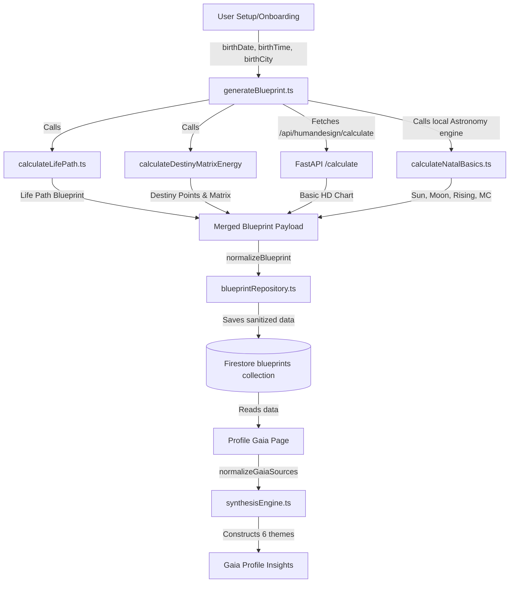

# BHUMI BLUEPRINT ENGINE SOURCE MAP V3 JOKER

## Grand Design & Field Parity Audit (Sprint 1)

This document maps all blueprint data owned, processed, and stored by Bhumi Amartya across its four core systems: **Human Design**, **Natal Chart**, **Destiny Matrix**, and **Numerology**. It highlights what fields are computed, what is stored in Firestore, what is actively utilized in UI/Narratives, and what is currently missing.

---

## 1. Human Design Source Map
> [!NOTE]
> Human Design calculation is considered production-fixed after the Gaia phase, but several semantic and lifestyle fields are dropped or unpopulated between the Python calculation engine and the Firestore repository.

| Field Name | Status | Source/Calculation Path | Storage Path | UI/Narrative Usage | Notes / Gaps / Risks |
| :--- | :--- | :--- | :--- | :--- | :--- |
| **Type** | Stored, Used in UI/Narrative | Python `/calculate` API, mapped via [hdkitAdapter.ts](file:///c:/Users/shein/bhumi-amartya-clean/lib/humandesign/hdkitAdapter.ts#L198) | `blueprints/{uid}.humanDesign.type` | Identity header, [synthesisEngine.ts](file:///c:/Users/shein/bhumi-amartya-clean/lib/profile/gaia/synthesisEngine.ts#L99) | Fully integrated and verified. |
| **Strategy** | Stored, Used in UI | Python `/calculate` API, mapped via [hdkitAdapter.ts](file:///c:/Users/shein/bhumi-amartya-clean/lib/humandesign/hdkitAdapter.ts#L199) | `blueprints/{uid}.humanDesign.strategy` | [FounderDebugHD.tsx](file:///c:/Users/shein/bhumi-amartya-clean/components/admin/FounderDebugHD.tsx#L23) | Stored and displayed in Admin panel. |
| **Authority** | Stored, Used in UI/Narrative | Python `/calculate` API, mapped via [hdkitAdapter.ts](file:///c:/Users/shein/bhumi-amartya-clean/lib/humandesign/hdkitAdapter.ts#L200) | `blueprints/{uid}.humanDesign.authority` | [synthesisEngine.ts](file:///c:/Users/shein/bhumi-amartya-clean/lib/profile/gaia/synthesisEngine.ts#L100) (decision-rhythm) | Fully integrated. |
| **Profile** | Stored, Used in UI | Python `/calculate` API, mapped via [hdkitAdapter.ts](file:///c:/Users/shein/bhumi-amartya-clean/lib/humandesign/hdkitAdapter.ts#L201) | `blueprints/{uid}.humanDesign.profile` | [FounderDebugHD.tsx](file:///c:/Users/shein/bhumi-amartya-clean/components/admin/FounderDebugHD.tsx#L21) | Stored and displayed in Admin panel. |
| **Definition** | Stored, Used in UI/Narrative | Python `/calculate` API, mapped via [hdkitAdapter.ts](file:///c:/Users/shein/bhumi-amartya-clean/lib/humandesign/hdkitAdapter.ts#L202) | `blueprints/{uid}.humanDesign.definition` | [synthesisEngine.ts](file:///c:/Users/shein/bhumi-amartya-clean/lib/profile/gaia/synthesisEngine.ts#L101) (relationships definition) | Fully integrated. |
| **Signature** | Available, Unstored, Unused | Python `/calculate` API returns `signature` (Satisfaction, Success, Peace, Surprise) | *None* | *None* | **Gap**: Dropped in [route.ts](file:///c:/Users/shein/bhumi-amartya-clean/app/api/humandesign/calculate/route.ts) / [blueprintRepository.ts](file:///c:/Users/shein/bhumi-amartya-clean/lib/repositories/blueprintRepository.ts#L58); not saved in Firestore. |
| **Not-Self Theme** | Available, Unstored, Unused | Python `/calculate` API returns `notSelfTheme` (Frustration, Bitterness, Anger, Disappointment) | *None* | *None* | **Gap**: Dropped in Next.js router and Repository layer; not stored in Firestore. |
| **Incarnation Cross** | Stored, Used in UI/Narrative | Python `/calculate` API, mapped via [hdkitAdapter.ts](file:///c:/Users/shein/bhumi-amartya-clean/lib/humandesign/hdkitAdapter.ts#L203) | `blueprints/{uid}.humanDesign.incarnationCross.name` | [synthesisEngine.ts](file:///c:/Users/shein/bhumi-amartya-clean/lib/profile/gaia/synthesisEngine.ts#L104) (spirituality) | Stores name only; design gates array is saved empty. |
| **Centers** | Stored, Used in UI | Python `/calculate` API, mapped via [hdkitAdapter.ts](file:///c:/Users/shein/bhumi-amartya-clean/lib/humandesign/hdkitAdapter.ts#L181) | `blueprints/{uid}.humanDesign.centers` | [FounderDebugHD.tsx](file:///c:/Users/shein/bhumi-amartya-clean/components/admin/FounderDebugHD.tsx#L53) | Map of boolean values for 9 centers. |
| **Gates** | Stored, Used in UI | Python `/calculate` API, mapped via [hdkitAdapter.ts](file:///c:/Users/shein/bhumi-amartya-clean/lib/humandesign/hdkitAdapter.ts#L208) | `blueprints/{uid}.humanDesign.gates` | [FounderDebugHD.tsx](file:///c:/Users/shein/bhumi-amartya-clean/components/admin/FounderDebugHD.tsx#L41) | Combined Personality & Design gates. |
| **Channels** | Stored, Used in UI/Narrative | Python `/calculate` API, mapped via [hdkitAdapter.ts](file:///c:/Users/shein/bhumi-amartya-clean/lib/humandesign/hdkitAdapter.ts#L209) | `blueprints/{uid}.humanDesign.channels` | [synthesisEngine.ts](file:///c:/Users/shein/bhumi-amartya-clean/lib/profile/gaia/synthesisEngine.ts#L102) (talents channels) | Fully integrated. |
| **Digestion** | Available, Unstored, Unused | Calculated in Python via variables (Design Sun Tone) | `blueprints/{uid}.humanDesign.digestion` | *None* | **Gap**: API V2 returns it inside nested variables; root `digestion` is `null`. TS wrapper maps root property, resulting in `null` in DB. |
| **Environment** | Available, Unstored, Unused | Calculated in Python via variables (Design Node Tone) | `blueprints/{uid}.humanDesign.environment` | *None* | **Gap**: Mapped as `null` in Firestore; ignored by synthesis engine. |
| **Perspective (View)** | Missing | *None* | *None* | *None* | Not computed by Python engine as a first-class field. |
| **Motivation** | Available, Unstored, Unused | Calculated in Python via variables (Personality Sun Tone) | `blueprints/{uid}.humanDesign.motivation` | *None* | **Gap**: Mapped as `null` in Firestore; ignored by synthesis engine. |
| **Cognition** | Available, Unstored, Unused | Calculated in Python via variables (Design Sun Tone) | `blueprints/{uid}.humanDesign.cognition` | *None* | **Gap**: Mapped as `null` in Firestore; ignored by synthesis engine. |
| **Sense** | Missing | *None* | *None* | *None* | Not computed by Python engine as a first-class field. |

---

## 2. Natal Chart Source Map
> [!IMPORTANT]
> The Natal Chart engine is severely under-implemented. The local engine [calculateNatalBasics.ts](file:///c:/Users/shein/bhumi-amartya-clean/lib/astrology/calculateNatalBasics.ts) only calculates 3 signs using a local astronomy library. All other planetary calculations, aspects, and houses are completely missing from calculations, despite the Gaia Synthesis engine attempting to read them.

| Field Name | Status | Source/Calculation Path | Storage Path | UI/Narrative Usage | Notes / Gaps / Risks |
| :--- | :--- | :--- | :--- | :--- | :--- |
| **Zodiac Type** | Tropical | Default in astrology calculations | (Implied) | (Implied) | Standardized to Tropical zodiac. |
| **House System** | Placidus | Default system in calculations | (Implied) | (Implied) | Houses other than Ascendant/Midheaven are not computed. |
| **Sun** | Stored, Used in UI/Narrative | [calculateSunSign.ts](file:///c:/Users/shein/bhumi-amartya-clean/lib/calculations/calculateSunSign.ts) | `blueprints/{uid}.natalChart.sunSign` | Identity card, element composition | Computed via simple Gregorian calendar date ranges. |
| **Moon** | Stored, Used in UI/Narrative | `Astronomy.EclipticGeoMoon` in [calculateNatalBasics.ts](file:///c:/Users/shein/bhumi-amartya-clean/lib/astrology/calculateNatalBasics.ts#L175) | `blueprints/{uid}.natalChart.moonSign` | Gaia Relationships tab, element composition | Calculated via Astronomy Engine. |
| **Mercury** | Missing | *None* | *None* | *None* | **Gap**: [normalizeSources.ts](file:///c:/Users/shein/bhumi-amartya-clean/lib/profile/gaia/normalizeSources.ts#L93) attempts to read `planets.mercury.sign` but receives `undefined`. |
| **Venus** | Missing | *None* | *None* | *None* | **Gap**: [normalizeSources.ts](file:///c:/Users/shein/bhumi-amartya-clean/lib/profile/gaia/normalizeSources.ts#L91) attempts to read `planets.venus.sign` but receives `undefined`. |
| **Mars** | Missing | *None* | *None* | *None* | **Gap**: [normalizeSources.ts](file:///c:/Users/shein/bhumi-amartya-clean/lib/profile/gaia/normalizeSources.ts#L94) attempts to read `planets.mars.sign` but receives `undefined`. |
| **Jupiter** | Missing | *None* | *None* | *None* | **Gap**: Attempts to read `planets.jupiter` return `undefined`. |
| **Saturn** | Missing | *None* | *None* | *None* | **Gap**: [normalizeSources.ts](file:///c:/Users/shein/bhumi-amartya-clean/lib/profile/gaia/normalizeSources.ts#L95) attempts to read `planets.saturn` but receives `undefined`. |
| **Uranus/Neptune/Pluto** | Missing | *None* | *None* | *None* | Not computed or stored. |
| **Lilith** | Missing | *None* | *None* | *None* | Not computed or stored. |
| **North Node** | Missing | *None* | *None* | *None* | **Gap**: [normalizeSources.ts](file:///c:/Users/shein/bhumi-amartya-clean/lib/profile/gaia/normalizeSources.ts#L96) attempts to read `planets.northNode` but receives `undefined`. |
| **South Node** | Missing | *None* | *None* | *None* | Not computed or stored. |
| **Ascendant (Rising)** | Stored, Used in UI/Narrative | Calculated in [calculateNatalBasics.ts](file:///c:/Users/shein/bhumi-amartya-clean/lib/astrology/calculateNatalBasics.ts#L120) | `blueprints/{uid}.natalChart.risingSign` | Identity card, element composition | Calculated via local horizon/ecliptic vectors. |
| **Midheaven (MC)** | Stored, Used in UI/Narrative | Calculated in [calculateNatalBasics.ts](file:///c:/Users/shein/bhumi-amartya-clean/lib/astrology/calculateNatalBasics.ts#L128) | `blueprints/{uid}.natalChart.midheaven` | Gaia Career tab, element composition | Calculated via sidereal time obliquity approximation. |
| **Planetary Positions** | Missing | *None* | *None* | *None* | Degrees and minutes of planets are not computed. |
| **Retrograde Status** | Missing | *None* | *None* | *None* | Not calculated. |
| **Element** | Stored, Used in UI/Narrative | Derived in [normalizeSources.ts](file:///c:/Users/shein/bhumi-amartya-clean/lib/profile/gaia/normalizeSources.ts#L40) | *None* (calculated on-the-fly) | Gaia Talents (elementComposition) | **Gap**: Calculated based *only* on Sun, Moon, Ascendant, and Midheaven. Under-represented. |
| **Modality & Polarity** | Missing | *None* | *None* | *None* | Cardinal, Fixed, Mutable modalities and Polarities are not computed. |
| **Aspects** | Missing | *None* | *None* | *None* | Conjunctions, Oppositions, Trines, etc., are not computed. |
| **Patterns (Yod, Stellium)** | Missing | *None* | *None* | *None* | Not calculated. |

---

## 3. Destiny Matrix Source Map
> [!WARNING]
> **Parity Status**: Requires separate post-Joker parity re-audit.
> The Destiny Matrix calculator is active, but a major key mapping bug in [mapToBlueprint.ts](file:///c:/Users/shein/bhumi-amartya-clean/lib/calculations/destinyMatrix/mapToBlueprint.ts#L10) has corrupted the **Karmic Tail** values (assigning outer points instead of bottom points).

| Field Name | Status | Source/Calculation Path | Storage Path | UI/Narrative Usage | Notes / Gaps / Risks |
| :--- | :--- | :--- | :--- | :--- | :--- |
| **Center Arcana** | Stored, Used in UI/Narrative | calculated as `epoint` in [energy.ts](file:///c:/Users/shein/bhumi-amartya-clean/lib/calculations/destinyMatrix/energy.ts#L114) | `blueprints/{uid}.destinyMatrix.arcanaCenter` | Identity card, Gaia Spirituality | Fully integrated. |
| **Money Line** | Stored, Used in UI/Narrative | `[jpoint, epoint, npoint]` in [mapToBlueprint.ts](file:///c:/Users/shein/bhumi-amartya-clean/lib/calculations/destinyMatrix/mapToBlueprint.ts#L9) | `blueprints/{uid}.destinyMatrix.moneyLine` | Gaia Career (moneyBlock/DNA) | Fully integrated. |
| **Love Line** | Stored, Used in UI/Narrative | `[spoint, epoint, tpoint]` in [mapToBlueprint.ts](file:///c:/Users/shein/bhumi-amartya-clean/lib/calculations/destinyMatrix/mapToBlueprint.ts#L8) | `blueprints/{uid}.destinyMatrix.loveLine` | Gaia Relationships (loveStyle) | Fully integrated. |
| **Father Line** | Stored, Used in Narrative | `[fpoint, gpoint, cpoint]` in [mapToBlueprint.ts](file:///c:/Users/shein/bhumi-amartya-clean/lib/calculations/destinyMatrix/mapToBlueprint.ts#L11) | `blueprints/{uid}.destinyMatrix.fatherLine` | Gaia Shadow (familyLines) | Fully integrated. |
| **Mother Line** | Stored, Used in Narrative | `[hpoint, ipoint, dpoint]` in [mapToBlueprint.ts](file:///c:/Users/shein/bhumi-amartya-clean/lib/calculations/destinyMatrix/mapToBlueprint.ts#L12) | `blueprints/{uid}.destinyMatrix.motherLine` | Gaia Shadow (familyLines) | Fully integrated. |
| **Ancestor Line** | Available, Unstored, Unused | Computed in [energy.ts](file:///c:/Users/shein/bhumi-amartya-clean/lib/calculations/destinyMatrix/energy.ts#L208) as `femalepoint`/`malepoint` | `blueprints/{uid}.destinyMatrix.ancestorLine` | *None* | **Gap**: Omitted in [mapToBlueprint.ts](file:///c:/Users/shein/bhumi-amartya-clean/lib/calculations/destinyMatrix/mapToBlueprint.ts); stored as `undefined`. |
| **Talent Line** | Stored, Used in UI/Narrative | Mapped as `talents` in [mapToBlueprint.ts](file:///c:/Users/shein/bhumi-amartya-clean/lib/calculations/destinyMatrix/mapToBlueprint.ts#L13) | `blueprints/{uid}.destinyMatrix.talents` | Gaia Talents (topTalents) | Stores great, father, and mother talent points. |
| **Karmic Tail** | Stored, Needs Parity Audit | Mapped in [mapToBlueprint.ts](file:///c:/Users/shein/bhumi-amartya-clean/lib/calculations/destinyMatrix/mapToBlueprint.ts#L10) | `blueprints/{uid}.destinyMatrix.karmicTail` | Gaia Shadow (karmicTail) | **Bug**: Maps `[apoint, bpoint, cpoint]` (Day, Month, Year) instead of bottom points. Mismatches expected `21-7-13` (current is `3-5-5`). |
| **Health Matrix** | Stored, Used in UI/Narrative | Mapped as `chartHeart` in [energy.ts](file:///c:/Users/shein/bhumi-amartya-clean/lib/calculations/destinyMatrix/energy.ts#L243) | `blueprints/{uid}.destinyMatrix.destinyIntelligence` | Gaia Energy (chakraProfile) | Normalized via [destinyMatrixIntelligence.ts](file:///c:/Users/shein/bhumi-amartya-clean/lib/engines/destinyMatrixIntelligence.ts#L129). |
| **Chakra Matrix** | Same as Health Matrix | Mapped as `chartHeart` in [energy.ts](file:///c:/Users/shein/bhumi-amartya-clean/lib/calculations/destinyMatrix/energy.ts#L243) | `blueprints/{uid}.destinyMatrix.destinyIntelligence` | Gaia Energy (chakraProfile) | Fully integrated. |
| **Dominant Arcana** | Missing | *None* | *None* | *None* | Not explicitly tracked or stored. |
| **Missing Arcana** | Missing | *None* | *None* | *None* | Not explicitly tracked or stored. |
| **Repeating Arcana** | Missing | *None* | *None* | *None* | Not explicitly tracked or stored. |

---

## 4. Numerology Source Map
> [!NOTE]
> Only **Life Path** values are active in user profiles. A complete name/birthday numerology engine [calculateNumerology.ts](file:///c:/Users/shein/bhumi-amartya-clean/lib/calculations/calculateNumerology.ts) exists, but is dead/unused code (never called). As a result, Destiny (Expression), Soul Urge, and Personality are completely missing from profiles.

| Field Name | Status | Source/Calculation Path | Storage Path | UI/Narrative Usage | Notes / Gaps / Risks |
| :--- | :--- | :--- | :--- | :--- | :--- |
| **Life Path** | Stored, Used in UI/Narrative | [calculateLifePath.ts](file:///c:/Users/shein/bhumi-amartya-clean/lib/calculations/calculateLifePath.ts#L31) | `blueprints/{uid}.lifePath` | Identity card, Gaia Career/Talents/Spirituality | Fully integrated. |
| **Birthday Number** | Missing | *None* | *None* | *None* | Not calculated. |
| **Destiny Number (Expression)** | Available, Unstored, Unused | Mapped in [calculateNumerology.ts](file:///c:/Users/shein/bhumi-amartya-clean/lib/calculations/calculateNumerology.ts#L38) | *None* | *None* | **Gap**: dead code (never called). Not saved in Firestore. |
| **Soul Urge** | Available, Unstored, Unused | Mapped in [calculateNumerology.ts](file:///c:/Users/shein/bhumi-amartya-clean/lib/calculations/calculateNumerology.ts#L39) | *None* | *None* | **Gap**: dead code (never called). Not saved in Firestore. |
| **Personality Number** | Available, Unstored, Unused | Mapped in [calculateNumerology.ts](file:///c:/Users/shein/bhumi-amartya-clean/lib/calculations/calculateNumerology.ts#L40) | *None* | *None* | **Gap**: dead code (never called). Not saved in Firestore. |
| **Maturity Number** | Missing | *None* | *None* | *None* | Not calculated. |
| **Pinnacles 1-4** | Missing | *None* | *None* | *None* | Not calculated. |
| **Challenges 1-4** | Missing | *None* | *None* | *None* | Not calculated. |
| **Personal Year** | Stored (on-the-fly), Used in UI/Narrative | [calculateYearlyNumerology.ts](file:///c:/Users/shein/bhumi-amartya-clean/lib/calculations/calculateYearlyNumerology.ts#L238) | *None* (dynamically calculated) | Daily Note / Daily Focus / Journaling prompts | Calculated dynamically based on current Gregorian year. |
| **Personal Month** | Missing | *None* | *None* | *None* | Not calculated. |
| **Personal Day** | Missing | *None* | *None* | *None* | Not calculated. |
| **Essence** | Missing | *None* | *None* | *None* | Not calculated. |
| **Transit Cycle** | Missing | *None* | *None* | *None* | Not calculated. |
| **Missing Numbers** | Missing | *None* | *None* | *None* | Not calculated. |
| **Repeating Numbers** | Missing | *None* | *None* | *None* | Not calculated. |

---

## 5. Data Flow Summary

1. **Input Phase**: The user triggers onboarding setup and provides birth metadata.
2. **Orchestration Phase**: [generateBlueprint.ts](file:///c:/Users/shein/bhumi-amartya-clean/lib/engines/generateBlueprint.ts) resolves the coordinates, calls local calculations for Numerology, Natal Basics, and Destiny Matrix, and proxies Human Design calculation requests to the Python microservice.
3. **Normalization & Storage Phase**: The combined blueprint is verified and cleaned via [blueprintRepository.ts](file:///c:/Users/shein/bhumi-amartya-clean/lib/repositories/blueprintRepository.ts) and saved directly to the Firestore database.
4. **Consumption Phase**: The frontend profile page loads the blueprint and calls the synthesis engine [synthesisEngine.ts](file:///c:/Users/shein/bhumi-amartya-clean/lib/profile/gaia/synthesisEngine.ts) to resolve weights, agreement scores, and compile them into six user themes (Shadow, Talents, Energy, Relationships, Career, Spirituality).

---

## 6. Major Gaps & Architectural Bottlenecks

1. **The Empty Variables (Digestion, Environment, Motivation, Cognition)**:
   * *Status*: Saved as `null` in the database, showing as missing in the UI.
   * *Reason*: The Next.js router [route.ts](file:///c:/Users/shein/bhumi-amartya-clean/app/api/humandesign/calculate/route.ts) fetches Python V2 API `/calculate` but fails to map these variables at root level. The TypeScript adapter maps them from `data.digestion` which is `undefined`.
2. **The Astrology Black Hole (Missing Planets & Aspects)**:
   * *Status*: Gaia synthesis expects full planets (Venus, Mars, Mercury, Saturn, North Node) but receives `undefined`.
   * *Reason*: [calculateNatalBasics.ts](file:///c:/Users/shein/bhumi-amartya-clean/lib/astrology/calculateNatalBasics.ts) does not calculate these planets; only Sun (simple date-range), Moon, Ascendant, and Midheaven are computed.
3. **Dead Numerology Code**:
   * *Status*: Destiny/Expression, Soul Urge, and Personality are missing from user blueprints.
   * *Reason*: A detailed calculation engine exists in [calculateNumerology.ts](file:///c:/Users/shein/bhumi-amartya-clean/lib/calculations/calculateNumerology.ts) but is dead/unused code.
4. **The Destiny Matrix Karmic Tail Bug**:
   * *Status*: Expected tail is `21-7-13`, current output is `3-5-5`.
   * *Reason*: [mapToBlueprint.ts](file:///c:/Users/shein/bhumi-amartya-clean/lib/calculations/destinyMatrix/mapToBlueprint.ts) erroneously maps `karmicTail` to `[apoint, bpoint, cpoint]` (which represents Day, Month, and Year base points) instead of bottom tail points.

---

## 7. Recommended Priority for Sprint 2 (Template & Insight Audit)

Given these gaps, Sprint 2 (Template & Insight Audit) should prioritize auditing the following pages as they are highly likely to be **FULL TEMPLATES** or **PLACEHOLDERS**:

1. **Komposisi Elemen (High Priority)**: Must be audited. Modality, polarity, and planetary positions are missing, making element counts incomplete.
2. **Chakra Profile (High Priority)**: Must be audited. Stored as raw `chartHeart` but lacking deep validation and currently a UI placeholder.
3. **Strongest Sense (Medium Priority)**: Sense and Perspective are not computed, meaning this page is a static placeholder/template.
4. **Career DNA & Money Block (Medium Priority)**: Environment and career details are largely missing, meaning they are likely using generic templates.
5. **Talent DNA (Medium Priority)**: Destiny, Soul Urge, and Personality are missing, making name-based numerology talent profiles templates.
