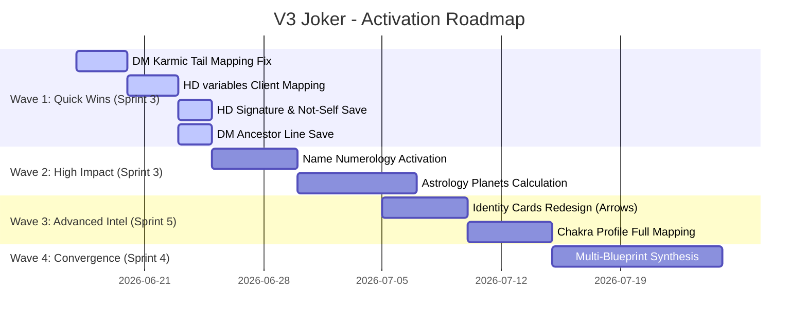

# BHUMI DORMANT DATA ACTIVATION PLAN
## V3 Joker - Template Audit & Dormant Data Activation Strategy (Sprint 2)

---

## Executive Summary

Bhumi Amartya is transitioning from a static blueprint viewer into a **Personal Intelligence System**. The core principle of V3 Joker is that **no valid, calculated blueprint data should remain permanently dormant**. Every data point must serve a clear purpose—whether in the User Interface, AI-generated Personal Narratives, the Founder Dashboard, or the cross-blueprint Convergence Engine.

This plan details:
1. A code-traced **Template Audit** of all 12+ profile modules.
2. A **Dormant Data Master List** across all 4 systems (Numerology, Human Design, Natal Chart, Destiny Matrix).
3. A **Value Scoring Matrix** and **Activation Strategy** for every dormant asset.
4. A **Four-Wave Roadmap** to activate this data starting with Sprint 3.

---

## Part 1: Template Audit

This audit traces the actual code pathways in [normalizeSources.ts](file:///c:/Users/shein/bhumi-amartya-clean/lib/profile/gaia/normalizeSources.ts) and [synthesisEngine.ts](file:///c:/Users/shein/bhumi-amartya-clean/lib/profile/gaia/synthesisEngine.ts) to classify every profile module.

### 1. Real Intelligence (High Data Confidence)
*These modules read active, calculated, and stored data from multiple blueprint systems.*
* **Chakra Profile**: Rated **REAL**. Reads the calculated `healthChart` / `chakraMatrix` values from Destiny Matrix points (`sahphysics`, `vishenergy`, etc.).
* **Inner Child**: Rated **REAL**. Successfully combines `natalChart.moonSign` (astronomy-engine) and `destinyMatrix.motherLine`/`fatherLine` (family program calculations).
* **Career DNA**: Rated **REAL**. Synthesizes `lifePath.role` (Numerology), `natalChart.midheaven` (astrology), `destinyMatrix.talents` (matrix), and `humanDesign.channels` (HD).

### 2. Semi-Template Intelligence (Partially Skewed / Weak Signals)
*These modules read some active data but rely heavily on generic fallbacks, have critical mapping bugs, or lack necessary planetary details.*
* **Talent DNA**: Rated **SEMI-TEMPLATE**. Reads `lifePath.positiveTraits` and `hd.channels`, but fails to read name numerology (Expression, Personality) and Mercury (communication sign) since they are missing or dead code.
* **Element Composition**: Rated **SEMI-TEMPLATE**. Computes Fire/Earth/Air/Water percentages dynamically, but only uses Sun, Moon, Ascendant, and Midheaven. Because the other 8 planets are missing, the resulting percentages are mathematically skewed.
* **Shadow Profile & Karmic Lessons**: Rated **SEMI-TEMPLATE**. Uses `destinyMatrix.karmicTail` but reads corrupted values due to the tail mapping bug. Saturn (lessons) is missing, leaving the narrative reliant on weak signals.
* **Relationship DNA (Love Style)**: Rated **SEMI-TEMPLATE**. Attempts to read `astrology.planets.venus` (always undefined), falling back entirely on Destiny Matrix's `loveLine` and HD profile.
* **Money Block**: Rated **SEMI-TEMPLATE**. Reads `moneyLine` and `karmicTail` (bugged), but lacks Saturn data.
* **Archetype Dominan**: Rated **SEMI-TEMPLATE**. Strictly maps to `lifePath.role` due to the lack of an actual arketipe engine or Destiny Matrix dominant arcana counts.
* **Strongest Sense**: Rated **SEMI-TEMPLATE**. Mapped to authority/type; the actual Human Design Sense is uncalculated.
* **Soul Mission**: Rated **SEMI-TEMPLATE**. Combines center arcana and Life Path, but is missing the astrology North Node coordinate.

### 3. Full Template / Placeholder Outputs (Zero Data Confidence)
*These modules receive zero signal inputs from the blueprint database, displaying only fallback text.*
* **Gift Gene Keys & Dominant Gene Keys**: Rated **PLACEHOLDER**. Strict source `["geneKeys"]` is never normalized or populated in `normalizeSources.ts`. Returns 100% template fallback.
* **Sacred Business**: Rated **FULL TEMPLATE**. Strict source `["sacredBusiness"]` is never populated, falling back entirely on the Life Path role.

---

## Part 2 & 3: Dormant Data Master List & Inventory

A complete catalog of all data assets that exist in calculations/APIs but are not currently stored, normalized, or surfaced.

### 1. Human Design Dormant Assets
* **Variables (Arrows)**: Computed in python API; saved in Firestore. Surfaced only in Admin panel. High intelligence value for learning and workflow styles.
* **Environment**: Always `null` in Firestore due to API mapping gaps in Next.js router. Surfaced as `null`. High value for work recommendations.
* **Cognition**: Always `null` due to mapping gaps. Surfaced as `null`. High value for mindfulness.
* **Motivation**: Always `null` due to mapping gaps. Surfaced as `null`. High value for daily drive.
* **Perspective (View)**: Missing completely in calculations; not computed.
* **Sense**: Missing completely in calculations; not computed.
* **Signature & Not-Self**: Calculated in Python; dropped in Repository save. Surfaced as `null`. High value for emotional checking and prompts.

### 2. Natal Chart Dormant Assets
* **Mercury / Venus / Mars / Jupiter / Saturn**: Missing in local calculations; not computed. Extreme value for mind, love, drive, expansion, and shadow boundaries.
* **North Node / South Node**: Missing in local calculations. North Node is expected by Gaia synthesis but returns undefined.
* **Uranus / Neptune / Pluto / Chiron**: Missing in calculations.
* **Houses**: Placidus houses are uncalculated (except Ascendant and Midheaven).
* **Aspects & Patterns (Yods, Stelliums)**: Missing in calculations.

### 3. Destiny Matrix Dormant Assets
* **Ancestor Line**: Calculated in the core energy math but dropped in `mapToBlueprint.ts`. Stored as `undefined`. High value for family lines.
* **Purpose Points**: Stored but never surfaced or used in UI or narratives.
* **Health / Chakra Matrix**: Stored in `destinyIntelligence` but unused in UI or narratives (only the dominant chakra is used).
* **Arcana Frequencies**: Uncalculated.

### 4. Numerology Dormant Assets
* **Expression (Destiny) / Soul Urge / Personality**: Calculated in `calculateNumerology.ts` but sits in dead code. Stored as `undefined`. High value for outer persona.
* **Maturity / Pinnacles / Challenges**: Uncalculated.
* **Personal Month / Personal Day**: Uncalculated.

---

## Part 4 & 5: Activation Strategy & Scoring Matrix

Every dormant asset is scored on **User Value** (impact on reading), **Narrative Value** (generates unique text), **Intelligence Value** (for convergence rules), and **Implementation Complexity** (1 = trivial client map, 10 = writing new astronomical algorithms).

| Field Name | System | User Value | Narrative | Intel | Complexity | Priority | Activation Strategy |
| :--- | :--- | :---: | :---: | :---: | :---: | :---: | :--- |
| **Karmic Tail (Bug Fix)** | Destiny Matrix | 10 | 10 | 9 | 2 | **CRITICAL** | Narrative, Convergence, UI |
| **Expression Number** | Numerology | 8 | 9 | 8 | 3 | **HIGH** | Identity, Narrative, Convergence |
| **Soul Urge Number** | Numerology | 8 | 8 | 7 | 3 | **HIGH** | Narrative, Journey |
| **Personality Number** | Numerology | 7 | 8 | 7 | 3 | **HIGH** | Narrative, UI |
| **Mercury Sign** | Natal Chart | 9 | 9 | 8 | 5 | **HIGH** | Narrative, Convergence, UI |
| **Venus Sign** | Natal Chart | 9 | 10 | 9 | 5 | **HIGH** | Narrative, Convergence, UI |
| **Mars Sign** | Natal Chart | 8 | 9 | 8 | 5 | **HIGH** | Narrative, Recommendations |
| **Saturn Sign** | Natal Chart | 9 | 9 | 9 | 5 | **HIGH** | Narrative, Convergence (Shadow) |
| **North Node Sign** | Natal Chart | 9 | 9 | 8 | 5 | **HIGH** | Narrative, Journey (Dharma) |
| **HD Environment** | Human Design | 8 | 8 | 8 | 2 | **HIGH** | Narrative, Recommendations |
| **HD Digestion** | Human Design | 8 | 8 | 7 | 2 | **HIGH** | Narrative, Recommendations |
| **HD Motivation** | Human Design | 8 | 8 | 7 | 2 | **HIGH** | Narrative, Reflection |
| **HD Cognition** | Human Design | 8 | 8 | 7 | 2 | **HIGH** | Narrative, Recommendations |
| **HD Signature** | Human Design | 8 | 7 | 7 | 3 | **MEDIUM** | Dashboard, Analytics |
| **HD Not-Self Theme** | Human Design | 8 | 7 | 7 | 3 | **MEDIUM** | Dashboard, Analytics |
| **Ancestor Line** | Destiny Matrix | 7 | 8 | 6 | 2 | **MEDIUM** | Narrative, Journey |
| **Chakra Matrix Values** | Destiny Matrix | 7 | 7 | 8 | 3 | **MEDIUM** | UI, Analytics |
| **HD Variables (Arrows)** | Human Design | 7 | 6 | 6 | 3 | **MEDIUM** | UI (Identity Architecture) |
| **South Node Sign** | Natal Chart | 7 | 7 | 7 | 5 | **MEDIUM** | Narrative, Shadow Convergence |
| **Jupiter Sign** | Natal Chart | 7 | 7 | 6 | 5 | **MEDIUM** | Narrative, Career |

---

## Part 6: Joker Activation Roadmap

### Wave 1: Quick Wins (Sprint 3)
*Focus: Resolving mapping bugs and client-side normalizations that require zero backend changes or new calculation algorithms.*
1. **Fix Destiny Matrix Karmic Tail mapping** in [mapToBlueprint.ts](file:///c:/Users/shein/bhumi-amartya-clean/lib/calculations/destinyMatrix/mapToBlueprint.ts) (Reroute `karmicTail` from outer points to bottom points).
2. **Resolve HD lifestyle variables** (`digestion`, `environment`, `motivation`, `cognition`) by mapping them from the existing `variables` sub-object in [hdkitAdapter.ts](file:///c:/Users/shein/bhumi-amartya-clean/lib/humandesign/hdkitAdapter.ts).
3. **Map and store HD Signature and Not-Self themes** in Firestore to make them accessible to AI prompts.
4. **Map Destiny Matrix Ancestor Line** to the blueprint object.

### Wave 2: High Impact (Sprint 3)
*Focus: Activating the dead name-numerology engine and implementing the missing core planet calculations in the local astrology engine.*
1. **Activate Name Numerology**: Integrate [calculateNumerology.ts](file:///c:/Users/shein/bhumi-amartya-clean/lib/calculations/calculateNumerology.ts) into the blueprint pipeline to calculate Expression, Soul Urge, and Personality.
2. **Implement Planetary Calculations**: Update [calculateNatalBasics.ts](file:///c:/Users/shein/bhumi-amartya-clean/lib/astrology/calculateNatalBasics.ts) using `astronomy-engine` to calculate the longitude and sign for Mercury, Venus, Mars, Saturn, Jupiter, and the Lunar Nodes.

### Wave 3: Advanced Intelligence (Sprint 5)
*Focus: Surfacing the visual layers in the UI.*
1. **Identity Architecture Redesign**: Surfacing the Human Design Variables (4 arrows) visually on the profile cards.
2. **Chakra Profile Mapping**: Surfacing the detailed physical, energetic, and emotional chakra scores on the balance tab.

### Wave 4: Convergence Expansion (Sprint 4)
*Focus: Orchestrating the convergence engine to combine data from different systems.*
1. **Construct Shadow Synthesis**: Yoking Saturn (astrology), Karmic Tail (matrix), and Not-Self (HD) for shadow work.
2. **Construct Career Synthesis**: Combining MC (astrology), Money Line (matrix), and Environment (HD) for career intelligence.
3. **Construct Relationship Synthesis**: Synthesizing Venus (astrology), Love Line (matrix), and Definition (HD) for relationship dynamics.
