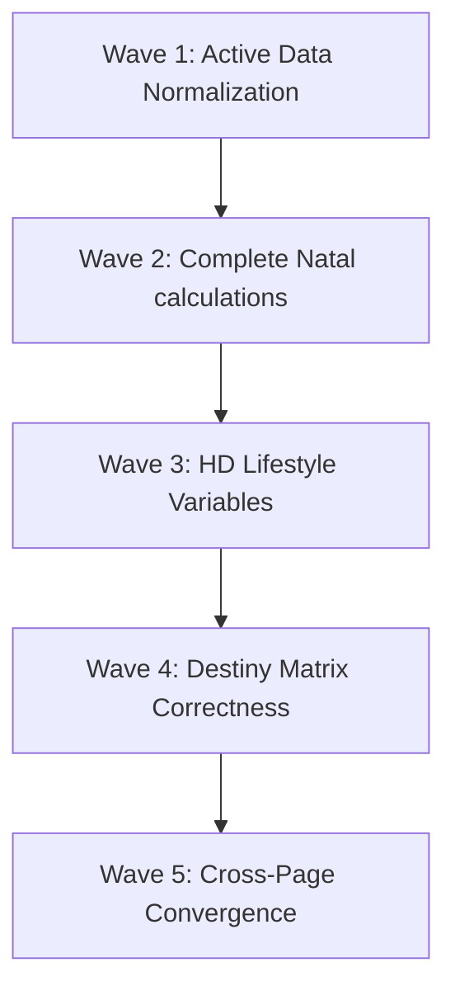

# JOKER FULL SOURCE ENGINE IMPLEMENTATION MATRIX
## V3 Joker - Grand Architecture & Multi-Blueprint Integration Matrix

---

## 1. Executive Summary

The V3 Joker update represents the transition of Bhumi Amartya from a collection of isolated, static personality blueprint summaries into a fully integrated, **Personal Intelligence System**. 

The fundamental architectural principle of V3 Joker is **zero dormant data**. If a piece of data is calculated, retrieved, and stored, it must be put to work. Conversely, the user must never be subjected to raw astrological or numerological data dumps. Data must flow through the **Cognitive Value Chain**:
$$\text{Raw Signal} \longrightarrow \text{Archetypal Meaning} \longrightarrow \text{Personal Relevance} \longrightarrow \text{Actionable Reflection/Innerwork}$$

This document defines the comprehensive master matrix for all 4 official blueprint systems, maps their derived signals across the entire app ecosystem (Dashboard, Kenali Diri, Innerwork, Profile Page), classifies them by priority, structures them into five implementation waves, and outlines the strict safety rules and verification protocols required to deliver a customized experience for each user.

---

## 2. Source Engine Inventory

Every calculated variable from the 4 core blueprint systems must be registered, stored, and routed. The inventory consists of:

### 1. Numerology Engine
* **Life Path Number**: Core structural frequency representing the native's natural flow and life path.
* **Expression (Destiny) Number**: Derived from the full birth name; represents outward capabilities, talents, and target realization.
* **Soul Urge (Heart's Desire) Number**: Derived from the vowels of the birth name; represents deepest inner desires and core motivations.
* **Personality Number**: Derived from the consonants of the birth name; represents the outer shield, first impressions, and public-facing persona.
* **Derived Traits**: Core behavioral tendencies calculated from numeric combinations.
* **Strengths**: High-frequency archetypal expressions of the core numbers.
* **Challenges**: Shadow expressions and lessons corresponding to karmic lessons of the primary numbers.
* **Role Patterns**: The fundamental archetype/vocation mapped to the primary numbers (e.g., Leader, Counselor, Builder).

### 2. Human Design Engine
* **Type & Strategy**: The aura mechanics and primary decision-making method (e.g., Generator: Respond, Projector: Wait for invitation).
* **Authority**: The internal compass (e.g., Emotional, Sacral, Splenic) for correct choice-making.
* **Profile**: The 2-digit role/costume (e.g., 1/3, 2/4, 5/1, 6/2) detailing the lifestyle and learning pattern.
* **Definition**: The configuration of energy flow (Single, Split, Triple Split, Quadruple Split) showing relational dependency.
* **Signature & Not-Self Theme**: The emotional feedback loop indicating alignment (e.g., Satisfaction vs. Frustration).
* **Centers (9 Defined/Undefined)**: The chakra/energy centers showing where the user is fixed/reliable versus open/receptive.
* **Gates (26 Active Positions)**: Precise activation keys marking specific traits and potentials.
* **Channels**: Unified energy circuits representing realized talents and superpowers.
* **Variables (4 Cognitive Arrows)**: The cognitive orientation detailing Digestion (how to take in food/info), Environment (ideal physical space), Perspective/View (how the mind sees), and Motivation (the psychological drive).

### 3. Natal Chart Engine
* **Sun**: Core identity, vitality, ego, and primary expression.
* **Moon**: Inner emotional landscape, subconscious needs, and feeling of safety.
* **Ascendant (Rising)**: The lens through which the world is viewed and the first impression projected.
* **Midheaven (MC)**: Public life, career peak, visible contribution, and legacy.
* **Mercury**: Communication style, intellect, learning processes, and cognitive patterns.
* **Venus**: Relationships, attraction, aesthetics, values, and receptive love style.
* **Mars**: Driving force, passion, action, physical energy, and boundaries.
* **Jupiter**: Areas of growth, luck, expansion, belief systems, and wisdom.
* **Saturn**: Lessons, limitations, fears, boundaries, discipline, and karmic blocks.
* **Uranus, Neptune, Pluto**: Generational shifts, subconscious transformations, spiritual path, and outer boundaries.
* **Chiron**: The core wound, vulnerability, and path to self-healing.
* **North Node & South Node**: Dharma/growth path (North) versus comfort zone/past-life patterns (South).
* **House Systems (Placidus & Whole Sign)**: Grid sectors mapping planets to life arenas (e.g., 2nd House: Finance, 7th House: Partnerships).
* **Elements, Modalities, Polarities**: Primary temperaments (Fire/Earth/Air/Water, Cardinal/Fixed/Mutable, Yin/Yang).
* **Aspects & Patterns**: Angles between planets (Conjunctions, Oppositions, Trines, Yods, Stelliums) representing internal harmony or friction.
* **Dominance**: The planet, sign, or element that holds the greatest energetic weight in the chart.

### 4. Destiny Matrix Engine
* **Center Arcana**: The soul's core identity, equilibrium, and anchor point.
* **Common Energy**: The general outer portrait presented to society.
* **Money Line**: The three-arcana combination mapping financial blockages, ideal vocations, and financial flow.
* **Love Line**: The three-arcana combination mapping relationship barriers, ideal partner qualities, and relationship patterns.
* **Karmic Tail**: The bottom three-arcana combination showing ancestral debts, past life baggage, and default coping loops.
* **Family Lines (Father & Mother Lines)**: Diagonal lines mapping generational trauma, patterns inherited from paternal and maternal lineages.
* **Ancestor Line**: Specific spiritual lineages and wisdom passed through ancestors.
* **Talents (Great, Father, Mother Talents)**: Karmic gifts and talents inherited from lineages.
* **Purpose Points**: Specific developmental milestones for personal, social, and spiritual destiny.
* **Chakra & Health Matrix**: Health, physical, energetic, and emotional mapping across the 7 primary chakras.
* **Arcana Frequencies**: The distribution of major arcanas across the matrix indicating dominant archetypal energies.

---

## 3. Derived Signal Inventory

Derived signals are synthesized by cross-referencing fields from different systems. They prevent "single-blueprint silos" and represent the real intelligence of Bhumi.

* **Emotional Shield (Moon + Authority + Not-Self Theme)**: Defines how a user processes stress. Combining Moon (astrology), Human Design Authority, and Not-Self theme creates a specific "De-escalation Routine" recommendation.
* **Career DNA Alignment (Midheaven + Money Line + HD Environment)**: Combines public peak (MC), financial flow/blocks (Destiny Matrix), and ideal workspace (HD Environment) to deliver actionable career recommendations.
* **Relationship Love DNA (Venus + Love Line + HD Definition)**: Combines romantic style (Venus), relational blockages (Love Line), and energetic dependency (HD Definition - e.g., Split Definition seeking companionship) for deep intimacy coaching.
* **Core Shadow/Block (Saturn + Chiron + Karmic Tail + Not-Self)**: Integrates boundaries/lessons (Saturn), core wound (Chiron), past life blocks (Karmic Tail), and primary trigger (Not-Self) into a targeted Shadow Integration map.
* **Dharma Path (North Node + Center Arcana + Soul Urge)**: Synthesizes destiny direction (North Node), core self (Center Arcana), and inner desire (Soul Urge) to construct a cohesive "Soul Mission".
* **Chakra-Energy Integrity (Health Matrix + HD Centers)**: Cross-references defined/undefined centers with the health matrix's physical/energetic chakra scores to locate physical blockages and energetic leaks.

---

## 4. Page Mapping Matrix

The matrix below maps every source field and derived signal across the four primary target pages:

| Source System | Specific Field / Signal | Dashboard Usage | Kenali Diri Usage | Innerwork Usage | Profile Page Usage |
| :--- | :--- | :--- | :--- | :--- | :--- |
| **Numerology** | Life Path Number | Daily Note, Focus Archetype | Identity Header | Weekly journaling prompts | Blueprint Overview card |
| **Numerology** | Expression Number | Saran Bhumi: Action Style | Strengths Inventory | Skill building practices | Talent DNA section |
| **Numerology** | Soul Urge Number | Daily Reflection hook | Core Desires Tab | Intention setting exercises | Soul Mission card |
| **Numerology** | Personality Number | *None (Support)* | Outer Shield card | Social boundaries exercises | Outer Persona Overview |
| **Numerology** | Strengths / Challenges | Practical Suggestions | Talent & Growth detail | Challenge mitigation prompts | Talent DNA section |
| **Numerology** | Role Patterns | Archetype Title | Archetype Card | Career-alignment meditation | Dominant Energy Profile |
| **Human Design** | Type & Strategy | Astro Hari Ini: Interaction tips | Aura Mechanics | Decision-making pause guide | Identity Overview card |
| **Human Design** | Authority | Daily Guidance hook | Core Compass | Emotional center alignment | Decision Rhythm card |
| **Human Design** | Profile | Practical Suggestions | Learning Styles | Daily boundary practices | Core Identity Card |
| **Human Design** | Definition | *None (Support)* | Relational Chemistry | Intimacy reflection | Relationship DNA |
| **Human Design** | Signature & Not-Self | Daily Note mood check | Alignment States | Emotional regulation checks | Shadow Profile |
| **Human Design** | Centers (9 Centers) | Energy Summary | Energetic Vulnerability | Center-based yoga routine | Chakra Profile |
| **Human Design** | Gates & Channels | Daily Focus detail | Channel Talents | Gate-specific affirmations | Talent DNA |
| **Human Design** | Variables (4 Arrows) | Daily productivity tips | Cognitive Profile | Breathwork style selection | Career DNA / Lifestyle |
| **Human Design** | Environment | Practical Suggestions | Ideal Surroundings | Workout location advice | Career DNA / Lifestyle |
| **Human Design** | Motivation | Daily drive prompt | Subconscious Motivator | Motivation shifting breaths | Soul Mission card |
| **Human Design** | Digestion | Practical Suggestions | Cognitive Assimilation | Eating mindfulness guide | Wellness Profile |
| **Human Design** | Perspective | Saran Bhumi hook | Mind's Eye Detail | Visualization meditation | Career DNA / Lifestyle |
| **Human Design** | Incarnation Cross | *None (Support)* | Life Purpose Map | Life milestone meditation | Soul Mission card |
| **Natal Chart** | Sun | Astro Hari Ini: Core focus | Identity Card | Solar plexus workout | Blueprint Overview |
| **Natal Chart** | Moon | Daily Note emotional check | Inner Needs Tab | Calming meditation choice | Inner Child Profile |
| **Natal Chart** | Ascendant (Rising) | Astro Hari Ini: Public presence| Outer Lens Card | Morning presence yoga | Blueprint Overview |
| **Natal Chart** | Midheaven (MC) | Practical Suggestions | Career Ambition Tab | Legacy reflection journal | Career DNA |
| **Natal Chart** | Mercury | Saran Bhumi: Communication | Thinking Profile | Communication exercise | Talent DNA |
| **Natal Chart** | Venus | *None (Support)* | Romantic Blueprint | Loving-kindness meditation | Relationship DNA |
| **Natal Chart** | Mars | Daily energy level note | Assertiveness Card | High-intensity workout guide | Shadow boundaries |
| **Natal Chart** | Jupiter | Daily expansion tip | Abundance Indicators | Joy / Gratitude practice | Money Block section |
| **Natal Chart** | Saturn | Daily limit/boundary note | Life Lessons Tab | Shadow integration journal | Shadow Profile |
| **Natal Chart** | Uranus/Neptune/Pluto | *None (Support)* | Subconscious Waves | Transcendent meditation | Soul Mission |
| **Natal Chart** | Chiron | Daily Vulnerability focus | Core Wound Card | Core wound integration | Shadow / Inner Child |
| **Natal Chart** | North / South Node | Daily growth prompt | Dharmic Path Card | Comfort zone release journal | Soul Mission |
| **Natal Chart** | Houses (Placidus/WS) | Today's active house | Life Arena Details | Area-specific affirmations | Career / Relationship DNA |
| **Natal Chart** | Elements / Modalities | Daily balance index | Temperament Composition| Elemental pranayama (breath) | Dominant Energy Profile |
| **Natal Chart** | Aspects & Patterns | Dynamic transit notes | Internal Harmony Map | Friction-resolution journaling| Talent / Shadow DNA |
| **Natal Chart** | Dominance | Today's leading archetype | Dominant Vibe | Dominance integration check | Dominant Energy Profile |
| **Destiny Matrix** | Center Arcana | Core Focus reflection | Soul Equilbrium | Central channel alignment | Blueprint Overview |
| **Destiny Matrix** | Common Energy | Daily social presence note | Outer Persona | Social connection journal | Outer Persona Profile |
| **Destiny Matrix** | Money Line | Practical Suggestions | Career Path Tab | Abundance blockage shadowwork | Money Block / Career |
| **Destiny Matrix** | Love Line | *None (Support)* | Relationship Needs | Heart-opening movement | Relationship DNA |
| **Destiny Matrix** | Karmic Tail | Daily trigger warning | Ancestral Debt Card | Ancestral karma release | Shadow Profile |
| **Destiny Matrix** | Family Diagonal Lines | *None (Support)* | Generational Trauma Map| Parental forgiveness journal | Shadow Profile |
| **Destiny Matrix** | Ancestor Line | Spirit Guidance Note | Ancestral Lineage | Lineage meditation | Soul Mission |
| **Destiny Matrix** | Talents | Practical Suggestions | Natural Gifts Tab | Talent embodiment prompt | Talent DNA |
| **Destiny Matrix** | Purpose Points | Daily milestone note | Purpose Roadmap | Spiritual alignment check | Soul Mission |
| **Destiny Matrix** | Chakra Matrix | Daily health indicator | Energetic Blueprint | Chakra balancing exercises | Chakra Profile |
| **Destiny Matrix** | Health Matrix | Daily wellness recommendation| Physical Health Tab | Somatic healing movement | Wellness Profile |
| **Destiny Matrix** | Arcana Frequencies | Today's frequency alignment| Archetype Distribution| Frequency integration breath | Dominant Energy Profile |
| **Derived Signal** | Emotional Shield | Daily Note mood check | Vulnerability profile | De-escalation exercise | Shadow Profile |
| **Derived Signal** | Career DNA | Saran Bhumi: Career | Vocation Roadmap | Work style integration | Career DNA |
| **Derived Signal** | Relationship DNA | *None (Support)* | Relationship Style | Relational friction guide | Relationship DNA |
| **Derived Signal** | Core Shadow/Block | Daily trigger warning | Shadow Mechanics | Targeted shadow work journal | Shadow Profile |
| **Derived Signal** | Dharma Path | Daily Focus: Dharmic alignment| Soul Mission Map | Dharma embodiment practice | Soul Mission |
| **Derived Signal** | Chakra Integrity | Energy Summary | Energetic Gaps Map | Pranic blockage clearance | Chakra Profile |

---

## 5. Priority Ranking

To manage complexity, implementation signals are ranked by impact and dependency:

### 1. Critical Priority (Foundation & Parity Gaps)
* **Karmic Tail (Destiny Matrix)**: Correcting the mapping bug (rerouting to bottom points instead of top-level points) is essential for accurate Shadow readings.
* **Mercury, Venus, Mars (Natal Chart)**: Essential to populate empty slots in Talent DNA, Relationship DNA, and Shadow boundaries.
* **Sun, Moon, Ascendant, Midheaven (Natal Chart)**: Core markers for the basic astrology blueprint layer.
* **Type, Strategy, Authority (Human Design)**: Core mechanics for decision-making and interaction logic.
* **Life Path Number (Numerology)**: The main frequency for core archetype assignment.

### 2. High Priority (Lifestyle & Path Realization)
* **HD Variables (Digestion, Environment, Motivation, Cognition)**: Crucial for generating personalized lifestyle advice.
* **Saturn, Chiron, North Node (Natal Chart)**: Core indicators of karmic lessons, emotional wounds, and life path trajectory.
* **Expression Number, Soul Urge (Numerology)**: Necessary to activate the dead name-numerology logic.
* **Money Line & Love Line (Destiny Matrix)**: Primary signals for financial blocks and relationship blueprints.
* **Midheaven / MC (Natal Chart)**: Core indicator of professional trajectory and outer visible legacy.

### 3. Medium Priority (Energetic & Diagonal Profiles)
* **Chakra & Health Matrix (Destiny Matrix)**: Maps detailed scores onto the energetic profile.
* **Defined & Undefined Centers (Human Design)**: Highlights areas of energetic stability vs. absorption.
* **Personality Number (Numerology)**: Provides context on outer social shields and first impressions.
* **Uranus, Neptune, Pluto (Natal Chart)**: Used to synthesize collective generational cycles and outer boundaries.
* **Family Diagonal Lines (Destiny Matrix)**: Generates ancestral trauma narratives in Shadow profiles.
* **Ancestor Line (Destiny Matrix)**: Surfaced in the spiritual tab to represent ancestral heritage.

### 4. Low Priority (Fringe/Aspect Harmonics)
* **Aspects, Modalities, Polarities (Natal Chart)**: Adds granular astrological detail for advanced users.
* **Purpose Points (Destiny Matrix)**: Refines destiny timelines and lifecycle milestones.
* **Arcana Frequencies (Destiny Matrix)**: Used to adjust tone and dominant archetypes.
* **Pinnacles, Challenges (Numerology)**: Used for long-term cycle predictions.

---

## 6. Implementation Waves

A phased sequence allows incremental deployment and comprehensive validation:

### Wave 1: Stored Active Data (Quick Wins)
* **Objective**: Fix simple client-side mapping gaps and store already calculated API fields.
* **Scope**:
  * Correct the Next.js router mappings to persist `signature` and `notSelfTheme` in Firestore.
  * Update [blueprintRepository.ts](file:///c:/Users/shein/bhumi-amartya-clean/lib/repositories/blueprintRepository.ts) to serialize HD Variables and Destiny Matrix Ancestor lines.
  * Display basic Human Design variables (4 Arrows) inside client adapters.

### Wave 2: Complete Natal Calculations
* **Objective**: Finalize backend calculations for planets, house systems, and nodes.
* **Scope**:
  * Implement calculations for Mercury, Venus, Mars, Jupiter, Saturn, Uranus, Neptune, Pluto, Chiron, and Nodes in both the Python API (`swisseph`) and TypeScript fallback (`astronomy-engine`).
  * Calculate **Placidus Houses** (primary) and **Whole Sign Houses** (supplementary) and store them in the `houses` record.
  * Implement astrological elements, modalities, and basic aspects.

### Wave 3: Human Design Lifestyle Deep-Signals
* **Objective**: Integrate and surface variables (Digestion, Environment, Motivation, Cognition) in the core app.
* **Scope**:
  * Update `synthesisEngine.ts` to read variables.
  * Build daily recommendation adapters for Diet (Digestion), Focus Spaces (Environment), and Mindset (Motivation).

### Wave 4: Destiny Matrix derived signals
* **Objective**: Resolve the Karmic Tail mapping bug and deploy ancestral/family lines.
* **Scope**:
  * Deploy the fix in `mapToBlueprint.ts` to point to bottom points.
  * Re-trigger calculations for affected users.
  * Integrate Family Lines (diagonal points) and Ancestor Line into the Shadow and Spiritual tab narratives.

### Wave 5: Cross-Page Intelligence Harmonization (Convergence)
* **Objective**: Deploy the full Convergence Engine, linking pages together using multi-blueprint rules.
* **Scope**:
  * Establish cross-blueprint scoring (e.g., matching astrology aspects with HD gates, matching numerology cycles with Destiny Matrix year arcana).
  * Harmonize daily guidance suggestions to prevent conflicting advice.

---

## 7. Safety Rules

To maintain the system's integrity, calculations and narratives must adhere to these rules:

1. **No Raw Data Dumps**: Never display raw numbers, degrees, or planetary signs without immediate, plain-language translation.
   * *Bad*: "Venus in Gemini, 7th House, 12.3°"
   * *Good*: "Cara komunikasimu dalam hubungan cenderung lincah dan didorong rasa penasaran (Venus di Gemini). Hari ini, arahkan energi ini untuk..."
2. **No Life Path / Sun Sign Overuse**: Avoid repeating "Karena kamu adalah Life Path 8..." or "Sebagai seorang Leo...". Use synthesized descriptors (e.g., "Sebagai tipe yang berorientasi pada pencapaian terstruktur..." or "Dengan dorongan kepemimpinan alamimu...").
3. **No Single-Blueprint Domination**: Ensure a balanced representation of all four systems. If a narrative focuses on Human Design Type, the next advice block should pivot to Destiny Matrix or Numerology.
4. **No Placeholder Intelligence**: Fallbacks must be intelligent. If a planet is undefined due to client calculation limits, fall back to general placement averages or a broader personality indicator (e.g., Sun Sign) without alerting the user of a system failure.
5. **No Fake Personalization**: Avoid general statements (the Barnum effect). Prompts and reflections must target specific, verified configurations (e.g., contrasting a defined G-center with an open emotional solar plexus).

---

## 8. Validation Protocol

To verify changes, we test across five Golden Users representing distinct configurations:

1. **Widhi**: Generator 1/3 (Sacral) | Taurus Sun, Libra Moon | Life Path 22 | Karmic Tail 18-9-9
2. **Ning**: Projector 6/2 (Splenic) | Libra Sun, Cancer Moon | Life Path 6 | Karmic Tail 15-20-5
3. **Widya**: Manifesting Generator 6/2 (Sacral) | Gemini Sun, Scorpio Moon | Life Path 4 | Karmic Tail 18-6-6
4. **Amartya**: Projector 5/1 (Splenic) | Gemini Sun, Taurus Moon | Life Path 9 | Karmic Tail 12-19-7
5. **Eva Syana**: Reflector 6/2 (Lunar) | Virgo Sun, Taurus Moon | Life Path 11 | Karmic Tail 15-8-11

### Validation Checklist
* **Dashboard Material Differences**: Ensure Widhi's dashboard focuses on response-based advice, while Eva Syana's focuses on lunar timing.
* **Innerwork Customization**: Verify that breathing and yoga recommendations change dynamically (e.g., cooling breaths for high-fire elements; grounding yoga for high-air elements).
* **Narrative Uniqueness**: Ensure generated personality profiles do not share identical paragraphs.
